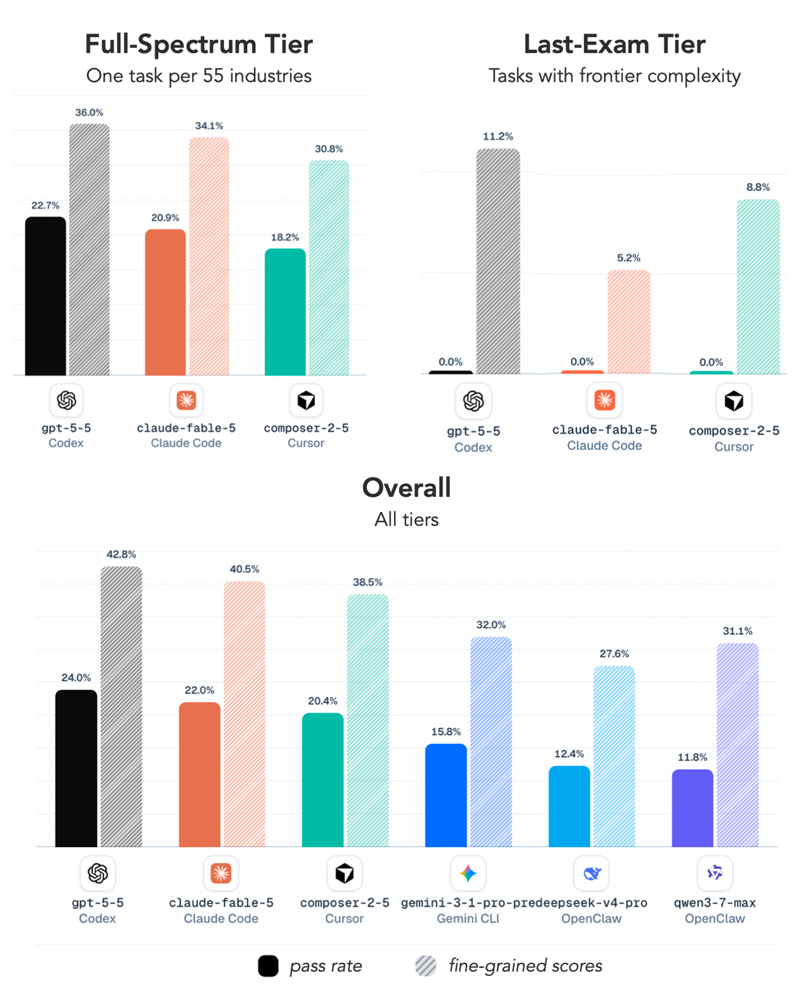
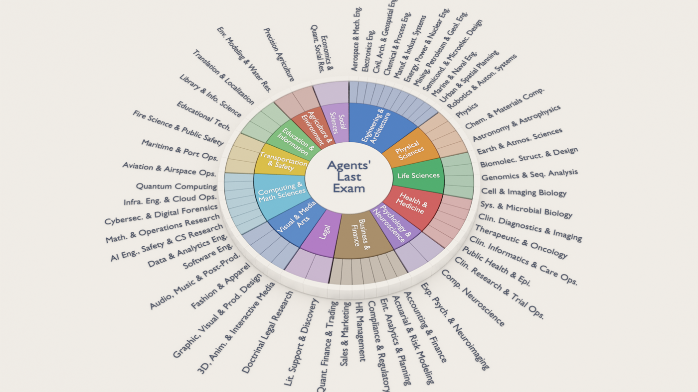
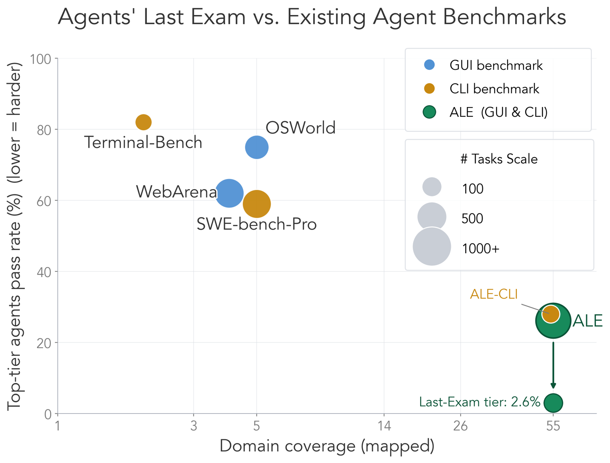
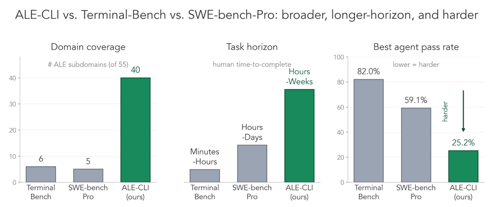
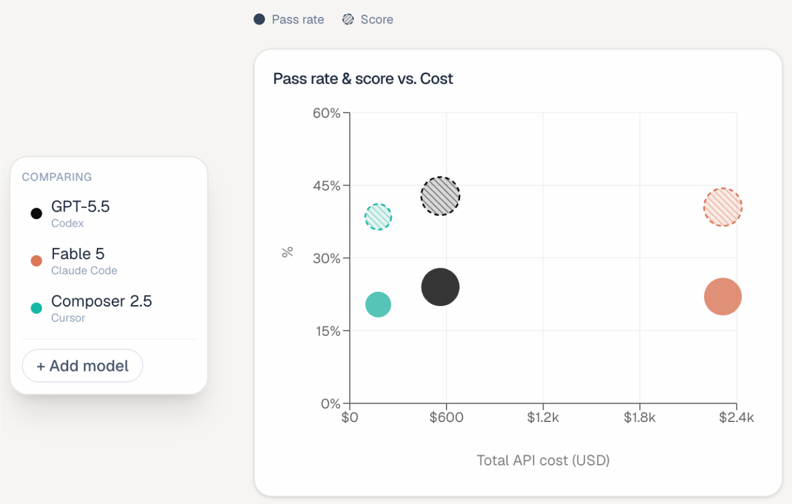
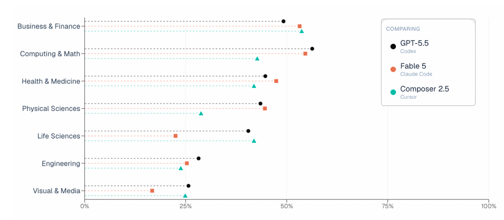
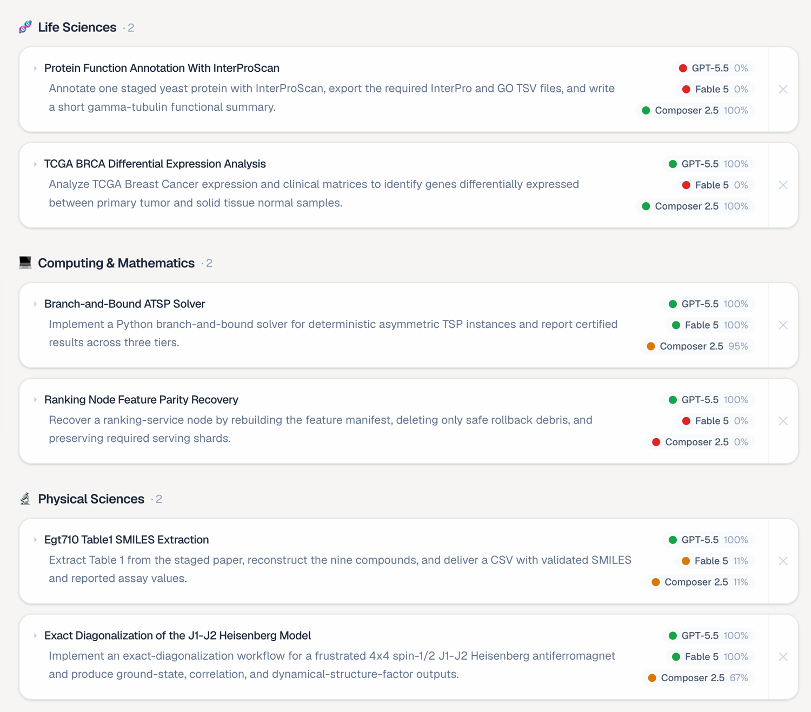

# Agents' Last Exam

    Yiyou Sun*, Xinyang Han*, Weichen Zhang*, Yuanbo Pang*, Tianyu Wang*, Yuhan Cao*, Yixiao Huang*, …, Dawn Song
 
(* for core contributors)
 
UC Berkeley RDI
 
June 2026
 
<em>(Est. 5-7 minutes read, more details at <a href="https://agents-last-exam.org" target="_blank">https://agents-last-exam.org</a>)</em>
 
Also on <a href="https://www.linkedin.com/pulse/introducing-agents-last-exam-ale-new-standard-evaluating-dawn-song-dntuc/" target="_blank">LinkedIn</a> and <a href="https://x.com/dawnsongtweets/status/2065095757988868190" target="_blank">X</a>

*Everyone says the latest AI agents will be "job-ready" soon, especially after the release of Fable 5 last week. But is that really the case?*

Over the past many months, Berkeley RDI has been building **Agents' Last Exam (ALE)**, a benchmark designed to test exactly that claim on real digital labor-market work. With ALE, we evaluated Fable 5, GPT-5.5, Composer 2.5, and other frontier agent systems across more than 1,500 expert-sourced tasks spanning 55 occupations. The result is both impressive and sobering. Today's agents can solve a meaningful fraction of professional tasks. However, when we look at the hardest tasks that require sustained reasoning, deep domain expertise, and reliable execution over long horizons, they are still far from human-level performance. On ALE's hardest tier, every frontier agent we tested, including Fable 5, achieved a 0% success rate.

The age of useful agents is here. The age of truly job-ready agents is not.

We hope Agents' Last Exam (ALE) will serve as a new guidepost and north star for developing agents capable of reliably performing economically valuable work across a broad range of domains.

---

## ALE is built from real work, not synthetic tasks

Every task is derived from a real project that a human expert previously completed and converted into a verifiable evaluation with objective grading. No vibes. No human judges. Fully reproducible.

ALE spans 55 non-physical occupations, grounded in the O\*NET / SOC 2018, the U.S. federal occupation taxonomy. It is built with 300+ experts from 100+ institutions across science, engineering, medicine, law, finance, education, and many other fields.

## How does ALE compare to existing agent benchmarks?

Many of today's agent benchmarks are rapidly saturating as frontier systems improve. ALE is designed to measure a different capability frontier: sustained, economically valuable work in real-world professional domains.

* 55 industry domains
* 1,500+ expert-sourced tasks
* Full GUI + CLI environments
* Outcome-based, verifiable evaluation

And if your agent only operates in the terminal, we've also released **ALE-CLI**, a CLI-only subset of the benchmark. Compared to Terminal-Bench and SWE-bench-Pro, it's **broader** (tasks span 40 of ALE's 55 industry subdomains, vs. 6 and 5), **longer-horizon** (human time-to-complete ranges from hours to weeks, not minutes or days), and **harder** (the best agent passes just 25.2%, vs. 82.0% on Terminal-Bench and 59.1% on SWE-bench-Pro). Plenty of headroom left to climb.

## Performance is only half the story

In ALE, Fable 5 joins GPT-5.5 and Composer 2.5 in the same overall performance cluster. But cost per task differs sharply:

→ Fable 5: ~$15.70 → GPT-5.5: ~$3.80 → Composer 2.5: ~$1.33

At current pricing, Fable 5 delivers similar performance while costing roughly 4–12× more per completed task.

## Why do ALE's results look different from some other benchmarks?

Because there is no universally best agent. Every frontier model, including Fable 5, has domains where it shines and domains where it struggles. Aggregate scores average over 55 occupations and 1,500+ tasks, causing many models to cluster together. But the average is not the story. The real signal lies in where agents succeed, where they fail, and how those patterns differ across domains. On identical tasks, different models often fail for very different reasons.

The most common failure mode remains a familiar one: agents declare success before they've truly verified their work. A typical completion reads: "Done. All checks pass." Yet the output may be missing required files, contain incorrect counts, omit key fields, or violate explicit constraints in the task specification. These failures occur far more often than many people expect.

Explore the interactive breakdown and concrete examples in our blog → <a href="https://agents-last-exam.org/blogs/agent-showdown" target="_blank">https://agents-last-exam.org/blogs/agent-showdown</a>

## Why "Last Exam"?

The name "Last Exam" reflects both the bar to clear for economically-valuable work, and the frontier of difficulty for real, complex, long-horizon tasks. While the age of useful agents is here, the age of truly job-ready agents is not.

We hope Agents' Last Exam (ALE) will serve as a new guidepost and north star for developing agents capable of reliably performing economically valuable work across a broad range of domains.

---

## Come test your agent on ALE

* **Website:** <a href="https://agents-last-exam.org" target="_blank">https://agents-last-exam.org</a>
* **Tasks:** <a href="https://agents-last-exam.org/demo" target="_blank">https://agents-last-exam.org/demo</a>
* **Leaderboard:** <a href="https://agents-last-exam.org/leaderboard" target="_blank">https://agents-last-exam.org/leaderboard</a>
* **Paper:** <a href="https://arxiv.org/abs/2606.05405" target="_blank">https://arxiv.org/abs/2606.05405</a>
* **Dataset:** <a href="https://huggingface.co/datasets/agents-last-exam/agents-last-exam" target="_blank">https://huggingface.co/datasets/agents-last-exam/agents-last-exam</a>
* **Code:** <a href="https://github.com/rdi-berkeley/agents-last-exam" target="_blank">https://github.com/rdi-berkeley/agents-last-exam</a>

## Join the Effort

To advance this frontier, we welcome contributors to help build our next-iteration benchmark by contributing tasks and referring domain experts (contributors will be invited to join as co-authors). Learn how to contribute at <a href="https://agents-last-exam.org/submit" target="_blank">https://agents-last-exam.org/submit</a>, and explore the leaderboard, paper, and demo at <a href="https://agents-last-exam.org" target="_blank">https://agents-last-exam.org</a>.
