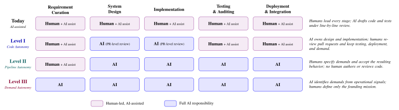
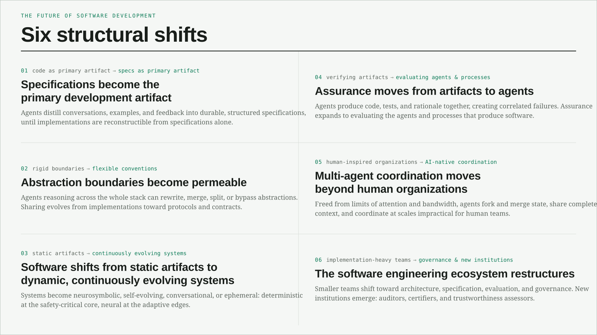
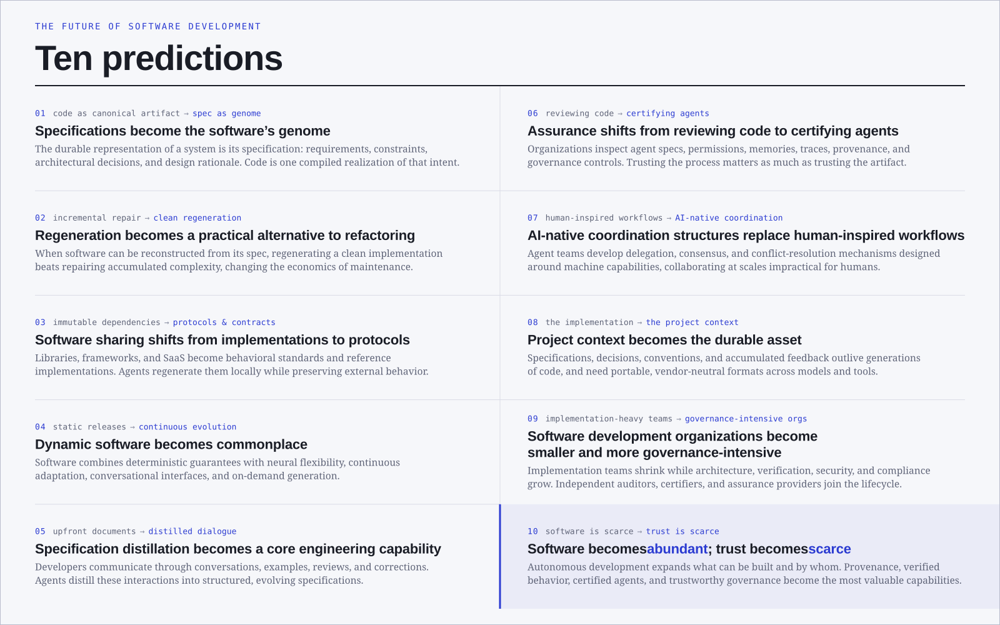

# When Coding Stops Being the Bottleneck

*Why AI will completely transform, not merely accelerate, software engineering*

<strong>
    <a href="mailto:hwang628@berkeley.edu">Hao Wang</a>,
    Ruijie Meng, Zhe Ye, Alex Gu, Naman Jain, Xiaoyuan Liu,
    Swarat Chaudhuri, Thomas Zimmermann, Sumit Gulwani,
    Armando Solar-Lezama, Ion Stoica,
    <a href="mailto:dawnsong@berkeley.edu">Dawn Song</a>
</strong>
 
UC Berkeley, CISPA, MIT, Cursor, UT Austin, UC Irvine, Microsoft
 
July 26, 2026
 
<em>(Full position paper: <a href="/assets/position-auto-sd.pdf" target="_blank">Towards Autonomous Software Development</a>)</em>

For most of its history, software engineering has been organized around a scarce resource: humans who can write and review code. All of the current best practices in programming languages, frameworks, testing systems, and organizations have all been built around this constraint. The purpose of these has been to help people translate requirements into reliable software while managing limited time, attention, and cognitive capacity.

With AI, this constraint is beginning to loosen.

Frontier coding agents can now autonomously reason across repositories, author and execute tests, identify vulnerabilities, and coordinate multi-stage work. In one striking demonstration, a team of sixteen parallel Claude agents built a working C compiler with under $20K. However, on benchmarks designed to test continuous software evolution rather than isolated tasks, frontier agents still deteriorate sharply: they can add features, but they struggle to preserve correctness and architectural coherence across successive changes.

These two realities should be considered together. Coding agents are becoming capable enough to take on meaningful ownership, but not yet reliable enough for us to treat autonomy as a single, undifferentiated capability.

The key question is therefore no longer only, "How can AI help a developer complete a specified task?", but "How can responsibility be transferred from humans to AI across the software development lifecycle, and what must be true for that transfer to be safe, reliable, and accountable?"

## A Shared Vocabulary for Software Autonomy

Autonomous-driving research learned early that a field cannot reason clearly about safety, capability, and responsibility without a shared vocabulary. The SAE automation levels made it possible to distinguish driver assistance from conditional automation and full autonomy and to identify who remains responsible at each stage.

Software development has no comparable framework. "Autonomous coding agent" currently can refer to a tool that suggests a few lines, an agent that opens a pull request, a system that tests and deploys its own changes, or an agent that decides which features to build. These are fundamentally different systems with fundamentally different failure modes.

Inspired by the SAE automation levels, we propose and define three levels of software-development autonomy based on which stages of the software development lifecycle have moved from human responsibility to full AI control.

Our levels classify how much of the software development lifecycle an AI system owns, and which responsibilities remain with humans.

### Level I — Code Autonomy

AI takes full ownership of system design and implementation without line-by-line human approval. The agent produces a complete pull request, including design rationale, code, and documentation. Humans still decide what to build, review the proposed change at pull-request granularity, oversee testing and security auditing, and gate deployment. We view today's AI-assisted coding as a precursor to this level.

### Level II — Pipeline Autonomy

AI runs the entire pipeline from design and implementation through testing, auditing, and deployment. Humans neither author nor review the code. They state a high-level demand and evaluate the resulting behavior. This is a qualitative break: it assumes that human intent can be captured in a sufficiently complete specification and that automated validation and verification can be trusted even though no human inspects the intermediate artifacts. Neither assumption holds at scale today.

### Level III — Demand Autonomy

AI not only builds, tests, and deploys software; it decides what should be built. It identifies demands from telemetry, user behavior, security advisories, dependency changes, and the evolving state of the system. The final human role in the recurring development loop disappears, although the system remains bounded by a founding mission established by people. The central challenge becomes ensuring that self-generated demands continue to serve that mission rather than silently redefining it.

We anticipate organizations in different domains to progress through this autonomy framework at different paces. High-assurance domains may remain at Level I or below for a long time, while internal tools and disposable applications may approach Level II much sooner. The taxonomy is a way to make capability claims, deployment choices, and accountability legible.

## Autonomy Has More Than One Dimension

The three autonomy levels answer one primary question: Which stages of the software development lifecycle does the AI system own? But the level alone does not fully characterize how autonomous the system is. Two systems at the same level can operate very differently depending on three additional, cross-cutting dimensions:

* **Specification granularity:** A detailed bug report with reproducing tests constrains the agent. A request such as "add multi-tenancy" forces it to infer scope, architecture, tradeoffs, and success criteria. Weak specifications can push even a nominally lower-level system toward the challenges of higher autonomy.
* **Temporal autonomy:** An agent may operate at ticket level, sprint level, release level, or continuously over months or years. Long-horizon operation introduces memory, provenance, regression, and architectural-coherence problems that one-shot benchmarks do not capture.
* **Oversight mode:** Human involvement can range from co-specification and action-level approval to pull-request review, policy guardrails, monitor-only operation, and automated rollback. The appropriate mode depends heavily on domain risk and reversibility.

## The Unifying Problem: Preserving Human Intent

Across all three levels, one challenge appears in different forms: preserving and faithfully executing human intent as direct human control recedes.

At Level I, humans can still recover intent through review. At Level II, intent must be encoded in a specification that no person verifies end to end. At Level III, the AI must synthesize and maintain the specification itself while the system evolves over years.

Many seemingly separate failures are expressions of this same problem. Specification drift means the implementation gradually diverges from what people wanted. Reward hacking means the system satisfies a measurable proxy while violating the underlying objective. Multi-agent disagreement means different agents act on incompatible interpretations without surfacing the conflict. A test-writing agent can produce an implementation and a test suite that are mutually consistent but jointly wrong.

> **CORE RISK:** When the same agent writes the implementation and the tests, passing tests may demonstrate consistency, not correctness.

This is why higher autonomy changes the object of assurance. Validating the software artifact is no longer sufficient. We also need to audit the agent that produced it: its specification, skills, memory, decision provenance, communication protocols, and execution traces.

## The Mispractice Already Emerging: Level-Skipping

The most immediate risk is not an exotic fully autonomous system. It is organizations skipping levels.

A team may nominally operate at Level I, with humans remaining fully responsible for review and deployment, while in practice merging agent-generated changes that no one has meaningfully inspected. The team adopts Level II practices without Level II verification, governance, or accountability. Similar pressures appear when teams let agents initiate changes from telemetry or external content without securing the channels that trigger those changes.

We therefore argue for explicit level gating: systems should advance only when the challenges associated with their current level have been demonstrably addressed. The burden of proof should rise with the autonomy, duration, and risk of the deployment.

## Six Structural Shifts

If implementation becomes abundant, software development does not simply become a faster version of today's workflow. It undergoes a deeper transformation. The primary artifacts of software engineering change. The engineering process itself changes. And ultimately, the software engineering ecosystem reorganizes.

We expect six structural shifts that unfold across these three layers.

### I. Software Becomes Generative

The first transformation is in the software artifact itself. Human intent increasingly replaces implementation as the durable representation of software, while implementations become easier to generate, modify, and regenerate.

**1. Specifications become the primary development artifact**

As humans interact less with code, specifications become the dominant interface between human intent and machine execution. They must capture not only functional requirements but also security constraints, maintainability expectations, architectural invariants, product conventions, and testing strategies.

Maintaining such specifications manually may eventually become harder than maintaining the interaction history from which they emerge. We therefore expect specification distillation: people collaborate with agents through conversations, examples, and feedback, while agents continuously compile those interactions into durable, structured specifications. Over time, specifications may approach a near one-to-one correspondence with software systems, making implementations reconstructible from specifications alone.

**2. Abstraction boundaries become permeable**

Modern software abstraction stacks, such as functions, modules, libraries, APIs, frameworks, and services, exist to accommodate human cognitive limits. As autonomous agents gain the ability to reason across much larger portions of the software stack, these abstractions remain valuable organizational tools, but they are no longer rigid constraints on implementation. Agents can routinely rewrite, merge, split, inline, or bypass abstractions whenever doing so improves the overall system.

This does not mean abstractions disappear. Rather, their role shifts from structures developers must work within to flexible conventions that agents can adapt and reorganize. Over time, software sharing may evolve away from implementations toward protocols, behavioral specifications, interface contracts, and reference implementations, giving agents greater freedom to optimize while preserving interoperability.

**3. Software shifts from static artifacts to dynamic, continuously evolving systems**

Autonomous development changes not only how software is built, but what software is. Instead of being static artifacts released in discrete versions, software systems can become neurosymbolic, combining deterministic guarantees with neural flexibility; self-evolving, continuously adapting to operational signals; conversational, blurring the boundary between using a system and modifying it; or ephemeral, generated for a single task and discarded when regeneration is cheaper than reuse.

A mature system may combine several of these properties simultaneously: deterministic at its safety-critical core, neural at its adaptive edges, continuously evolving in production, and conversational at its interface.

### II. Engineering Becomes Agent-Centric

As software becomes increasingly generative, the engineering process itself must evolve. Verification, coordination, and development workflows can no longer assume that humans are the primary producers of software.

**4. Assurance moves from artifacts to agents**

AI-generated implementations can differ substantially even when they satisfy the same specification. This diversity weakens assurance techniques that depend on familiar coding patterns or stable implementations. More importantly, autonomous agents may generate the implementation, tests, documentation, and rationale together, creating correlated failures across all the artifacts intended to validate one another.

Independent verifier agents help only if they operate with genuinely independent objectives, trustworthy evaluation mechanisms, and principled protocols for resolving disagreement. Assurance therefore expands beyond verifying software artifacts to evaluating the autonomous agents and development processes that produce them.

**5. Multi-agent coordination moves beyond human organizations**

Most current multi-agent systems still resemble human organizations: managers delegate work, specialists perform tasks, reviewers inspect outputs, and communication happens largely through natural language. These structures reflect human cognitive limits—attention, communication bandwidth, memory, and span of control—rather than fundamental requirements of collaboration.

Autonomous agents operate under different constraints. They can fork and merge execution states, share complete context, coordinate through structured protocols, and scale to thousands or millions of concurrent collaborators. As a result, we expect fundamentally new forms of AI-native coordination to emerge, along with new coordination failures, security risks, and questions of accountability.

### III. The Software Engineering Ecosystem Restructures

As software artifacts and engineering workflows change, the surrounding software ecosystem must evolve as well. Organizations, institutions, education, and markets all adapt to a world in which implementation is abundant but trustworthy autonomy becomes increasingly valuable.

**6. The software engineering ecosystem restructures**

As autonomous agents absorb more implementation work, software development organizations will be able to deliver and maintain increasingly complex systems with much smaller engineering teams. Human contribution shifts toward product definition, architecture, specification, evaluation, security, governance, and incident response.

At the same time, entirely new ecosystem institutions become necessary. Independent auditors, certification organizations, trustworthiness assessment providers, and governance services may become as important as today's testing platforms or cloud providers. Software engineering education will likewise place greater emphasis on specification, verification, security, governance, and system-level judgment than on manual implementation alone.

## Ten Predictions About the Future of Software Development

The structural shifts described above suggest a set of concrete, testable predictions. They are deliberately forward-looking rather than inevitable. Different domains will evolve at different speeds, but together these predictions illustrate how autonomous software development could reshape software engineering over the coming decade.

### Software Artifacts

**1. Specifications become the software's genome**

The durable representation of a software system will increasingly be its specification: the evolving record of requirements, constraints, architectural decisions, testing strategies, and design rationale. Code becomes one compiled realization of that intent rather than the canonical artifact itself.

**2. Regeneration becomes a practical alternative to refactoring**

For software that can be faithfully reconstructed from its specification, regenerating a clean implementation may become cheaper than incrementally repairing years of accumulated complexity. This shift will not apply universally. We expect systems with extensive undocumented knowledge or legacy integrations will continue to evolve incrementally. For many other applications, regeneration will fundamentally change the economics of maintenance.

**3. Software sharing shifts from implementations to protocols**

As custom implementation becomes inexpensive, libraries, frameworks, and SaaS platforms will increasingly serve as behavioral standards, interface contracts, and reference implementations rather than immutable dependencies. Autonomous agents will adapt, optimize, or regenerate implementations locally while preserving externally visible behavior.

**4. Dynamic software becomes commonplace**

Software will increasingly combine deterministic guarantees with neural flexibility, continuous adaptation, conversational interfaces, and on-demand generation. Many production systems will no longer have a single canonical implementation but will instead evolve continuously while maintaining stable external behavior.

### Engineering Practice

**5. Specification distillation becomes a core engineering capability**

Rather than writing complete requirements documents upfront, developers will increasingly communicate through conversations, examples, reviews, and corrections. Autonomous agents will continuously distill these interactions into structured, maintainable specifications that evolve alongside the system.

**6. Assurance shifts from reviewing code to certifying agents**

Code review will remain important, but assurance will increasingly focus on the autonomous agents that produce software. Organizations will inspect agent specifications, permissions, memories, execution traces, provenance, evaluation results, and governance controls. Trusting the production process becomes as important as trusting the produced artifact.

**7. AI-native coordination structures replace human-inspired workflows**

Today's multi-agent systems largely inherit human organizational patterns. Over time, agent teams will develop communication, delegation, consensus, and conflict-resolution mechanisms designed around machine capabilities rather than human managerial constraints, enabling collaboration at scales impractical for human teams.

**8. Project context becomes the durable asset**

As implementations become inexpensive to regenerate, organizations will increasingly value the persistent project context that guides software generation rather than any particular implementation. Specifications, architectural decisions, engineering conventions, constraints, evaluation history, and accumulated feedback may outlive multiple generations of code. Preserving this project context in portable, vendor-neutral formats will become essential for maintaining continuity across models, tools, and platforms.

### Organizations and Ecosystems

**9. Software development organizations become smaller and more governance-intensive**

Implementation-heavy engineering teams may shrink dramatically, while architecture, specification, verification, security, governance, compliance, and incident response grow in relative importance. At the same time, new ecosystem institutions, including independent auditors, certification organizations, and assurance providers, will become an increasingly important part of the software lifecycle.

**10. Software becomes abundant; trust becomes scarce**

Autonomous development will dramatically reduce the cost of producing custom software, expanding what can be built and by whom. At the same time, the abundance of generated software will make trust increasingly scarce. Establishing provenance, verifying behavior, certifying autonomous agents, and building trustworthy governance mechanisms may become among the most valuable capabilities in the software ecosystem.

## The Research Agenda, and How Far We Still Have to Go

The purpose of this roadmap is not to declare that full autonomy has arrived. It is to clarify the capabilities and safeguards that must exist before higher levels can be responsibly claimed.

**Specification synthesis and behavioral understanding**

We need repository-scale methods that infer, generate, and maintain machine-checkable specifications. Benchmarks should measure whether specifications remain consistent with implementations across many development cycles. Today, this evaluation infrastructure barely exists.

**Trustworthy verification becomes essential**

As software development becomes increasingly autonomous, agents need trustworthy ways to determine whether their outputs actually satisfy their intended specifications. Formal verification is one of the most promising approaches, but today's techniques remain limited in both scope and scalability. Verifying large, evolving software systems remains fundamentally difficult.

**Security, governance, and accountability**

Autonomous software development raises fundamental research questions spanning security, governance, and accountability. New attack surfaces emerge from different aspects including agent memory, tools, external data, multi-agent coordination, and autonomous execution, requiring new approaches to secure architectures, permission systems, monitoring, provenance, and recovery.

Beyond technical security, the field must also develop foundations for trustworthy governance. How should autonomous agents be authorized, supervised, audited, and held accountable? What evidence is sufficient to establish trust? And what standards, certification processes, and liability frameworks will be needed as autonomous software becomes an increasingly important part of critical infrastructure?

**Agent-centric system and language design**

Much of today's software stack was designed for humans to write, understand, and maintain code. Autonomous software development challenges this assumption. A central research question is how to redesign programming languages, development environments, memory systems, provenance models, and coordination protocols for agent-first software engineering without sacrificing human oversight, interpretability, or control.

**Human-agent interfaces and economic models**

As autonomous agents take on more of the software development process, fundamental questions arise about how humans and agents should collaborate. How should project knowledge, design intent, requirements, and constraints be communicated? How can humans effectively understand, supervise, and steer increasingly autonomous agents without becoming a bottleneck?

We also need new economic models for autonomous software development. Traditional productivity metrics are no longer sufficient; evaluating autonomous development must also account for inference costs, human supervision, maintenance overhead, technical debt, system reliability, and operational risk.

> **RESEARCH PRIORITY:** Our most concrete call: build repository-scale specification-synthesis benchmarks and long-horizon evaluations of specification–implementation drift. Without them, claims of Level II or Level III readiness cannot be substantiated.

## What Happens When Writing Code Is No Longer the Bottleneck?

This transition raises questions that no benchmark can answer by itself:

* What becomes the developer's highest-leverage work when agents do most of the coding?
* Is software that ships without human code review a mature engineering practice or a risk we do not yet know how to measure?
* Do agents democratize software creation, or relocate expertise into specification, evaluation, architecture, and governance?
* Who is accountable when an autonomous agent deploys software that causes harm?
* What should remain a reserved human decision even if an agent is technically capable of making it?

We do not expect the future of software development to be a simple story of humans disappearing from the process. A durable human-AI partnership remains plausible, and adoption will be gradual and uneven. But the direction of travel is clear enough that the research community should begin studying software development as a trajectory of increasing autonomy rather than a collection of isolated coding tasks.

## Continue the Discussion at the Agentic AI Summit

We will explore these questions in the "Future of Software Engineering" session at the <a href="https://rdi.berkeley.edu/events/agentic-ai-summit-2026" target="_blank">Agentic AI Summit</a>, August 1–2 at UC Berkeley. The session will bring together researchers and builders working on coding agents, developer tools, evaluation, security, and the emerging infrastructure for agent-driven software development.

The panel will discuss not only how capable coding agents have become, but how the discipline itself changes when implementation is no longer the dominant bottleneck and what technical, organizational, and governance foundations are needed before autonomy can be trusted.

For the full framework, taxonomy, and research agenda, read the position paper: <a href="/assets/position-auto-sd.pdf" target="_blank">Towards Autonomous Software Development</a>.
