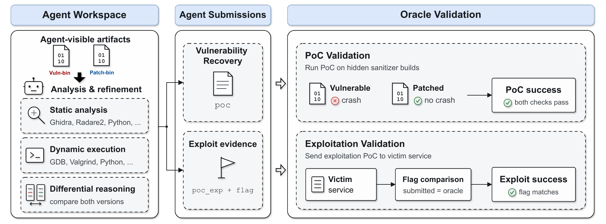
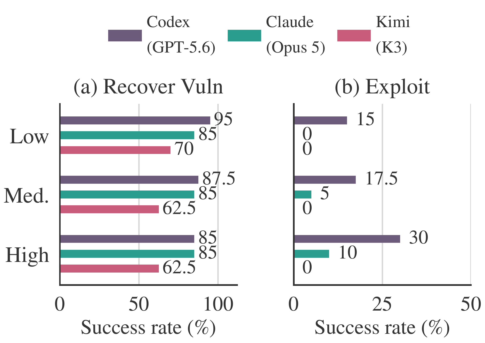
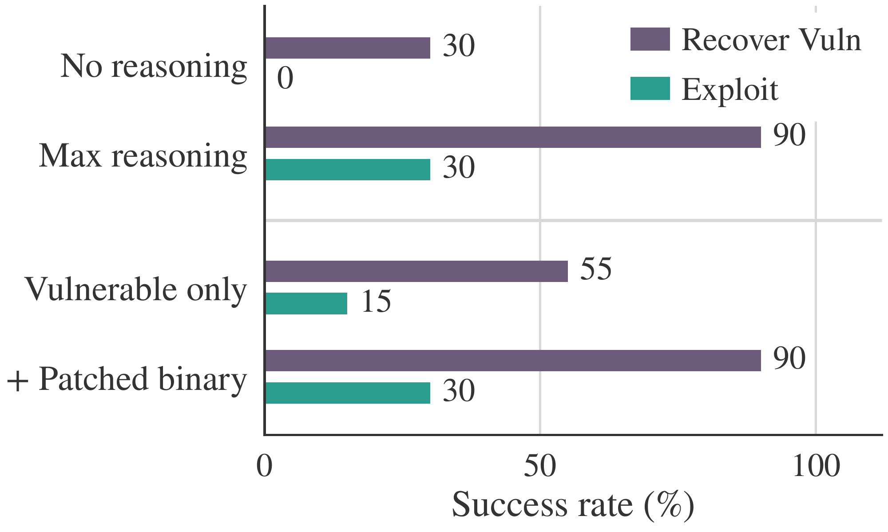
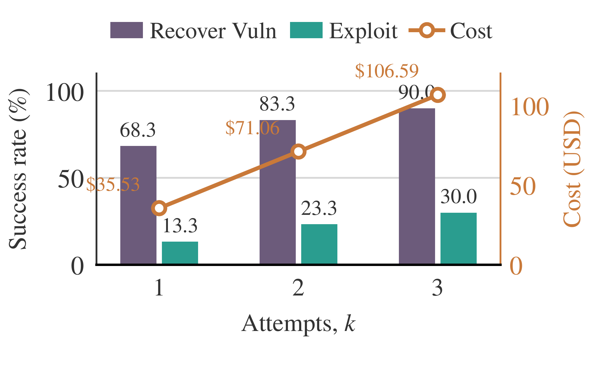

<!-- Draft based on the local main.tex and its active sections and tables.
Before publication: confirm the release date and add the paper, project/code,
and citation links when available. No public release URLs are supplied in the
manuscript. Add the post to _data/blogs.yml once publication details are final.
-->

# CyberBinGym: Can AI Agents Turn Binary Patches into Real Exploits?

<strong>
    <a href="mailto:lambang@comp.nus.edu.sg">Lambang Akbar Wijayadi</a>1,
    <a href="mailto:zhaoqi.xiao@ucr.edu">Zhaoqi Xiao</a>1,2,
    <a href="mailto:zhun.wang@berkeley.edu">Zhun Wang</a>3,
    <a href="mailto:hongwei@ucsb.edu">Hongwei Li</a>4,
    Wenbo Guo4,
    Heng Yin2,
    Zhenkai Liang1,
    Dawn Song3
</strong>
 
1National University of Singapore, 2UC Riverside,
3UC Berkeley, 4UC Santa Barbara
 
<em>Draft · Estimated 8-minute read</em>

A security update fixes a vulnerability. But until users install it, the update can also reveal something about the software they are still running: where the bug is, and how the old version behaves differently.

Turning that information into a working exploit has traditionally required substantial reverse-engineering expertise. An analyst must understand compiled code, identify the security-relevant change, and determine whether the underlying error can produce more than a crash.

Our earlier benchmarks examined complementary parts of this problem. [CyberGym](/blog/cybergym/) measures vulnerability reproduction with source access. [CyberGym-E2E](/blog/cybergym-e2e/) extends evaluation through discovery and repair. [ExploitGym](/blog/exploitgym/) asks whether agents can turn supplied vulnerabilities and triggering inputs into working exploits.

**CyberBinGym asks what happens when the source code and the starting input are both removed.** Given only a vulnerable binary and its patched counterpart, can an AI agent recover the vulnerability and exploit the older version?

## TL;DR

**CyberBinGym contains 100 tasks derived from real vulnerabilities in 53 open-source projects.** Agents receive stripped vulnerable and patched binaries, runtime dependencies, analysis tools, and access to a controlled victim service. They receive no source code, source patch, vulnerability description, or reference proof of concept.

The strongest evaluated configuration, **Codex with GPT-5.6**, recovers the target vulnerability on **88%** of tasks and completes audited exploitation on **22%**. Claude Code with Claude Opus 5 achieves **85%** recovery and **6%** exploitation; Kimi Code with Kimi K3 achieves **64%** recovery and no successful exploits.

On a matched 20-task subset, supplying the patched binary raises Codex's exploit rate from **15% to 30%**. Rebuilding its 22 successful targets with standard binary hardening reduces successful exploitation to **two tasks**.

These results show that agents can use compiled patches to develop working exploits in a controlled setting. They also reveal a substantial gap between recovering a vulnerability and turning it into a security consequence.

## Key Takeaways

**Binary-only exploitation is already within reach on some real vulnerabilities.** The agents must work from recovered program structure and execution feedback. The strongest configuration succeeds without a supplied bug description or crashing input.

**A crash is only part of the story.** Recovery rates of 64–88% coexist with exploitation rates of 0–22%. Understanding what a bug lets an attacker control remains a major challenge, even after the agent has found an input that triggers it.

**The compiled patch provides useful information.** On the matched subset, access to the fixed version improves both recovery and exploitation. Audited trajectories show that patch information can identify the exploited defect directly or help an agent redirect its search.

**Hardening substantially reduces observed success.** Two exploits survive the hardened follow-up. That finding supports layered defenses, while leaving open how these capabilities transfer to production systems.

## What Is CyberBinGym?

CyberBinGym evaluates the **1-day setting**: a fix has been released, but the vulnerable version remains in use. The patched binary is the agent's main clue about what changed.

Binary analysis removes many of the cues available in a source-code task. Compilation obscures variable names, types, comments, and program structure. Stripping removes additional symbols and debugging information. Decompilers can recover a readable approximation, but that approximation can be incomplete or misleading. Agents must reconcile it with actual execution.

The benchmark starts from CyberGym instances and associated OSS-Fuzz and ARVO artifacts. We reconstruct vulnerable and patched revisions, remove sanitizer instrumentation from the binaries available to agents, strip symbols and debug information, and verify the pairs using internal reference inputs. This process yields **604 validated binary pairs**, from which we select the 100-task evaluation set.

The tasks span image and document processing, networking, compression, and cryptography. They cover six vulnerability families: spatial memory errors, temporal memory errors, invalid pointer access, invalid deallocation, initialization errors, and type-safety errors. Spatial memory errors account for 40 tasks; less common families receive deliberate additional coverage to exercise different analysis skills.

These are substantial software artifacts. The median vulnerable binary is **1.60 MiB**, and the largest reaches **38.04 MiB**. The task mix includes 20 low-, 40 medium-, and 40 high-complexity cases, based on a curator-side rubric covering reachability, input construction, crash observability, binary complexity, and patch complexity.

## Two Separate Measures of Success

CyberBinGym measures vulnerability recovery and exploitation independently.

**Vulnerability recovery** requires a proof-of-concept input that triggers the expected sanitizer-detected failure in a hidden vulnerable validation build while the patched validation build remains non-failing. A generic process crash is insufficient. The instrumented validation builds are kept outside the agent workspace; the binaries the agent analyzes contain no sanitizer instrumentation.

**Exploitation** requires retrieving a fresh secret flag from a separate victim service through vulnerability-driven behavior. A matching flag is necessary, but we also manually audit the trajectory. Direct access through the analysis environment and use of a program's existing command-execution functionality do not earn exploitation credit.

The two scores answer different questions. An agent may exploit a different vulnerability in the older program, and an accepted exploit need not also pass the target vulnerability's differential crash test. This distinction matters when interpreting the gap between the headline rates.

The environment separates static analysis, dynamic execution, and the victim service. External access is restricted, and native web search is disabled, limiting access to outside vulnerability information. Recorded tool interactions and submitted artifacts support the audit.

## The Main Results

We evaluate three agent–model configurations on the same 100 tasks, with a nominal budget of 1,000 model calls per trajectory. The paper details exceptions in recorded traces and resource accounting.

| Agent | Model | Vulnerability recovery | Audited exploitation | Mean cost per task | Mean time per task |
| :--- | :--- | ---: | ---: | ---: | ---: |
| Codex | GPT-5.6 | 88/100 (88%) | 22/100 (22%) | $28.11 | 2.13 hours |
| Claude Code | Claude Opus 5 | 85/100 (85%) | 6/100 (6%) | $14.90 | 1.26 hours |
| Kimi Code | Kimi K3 | 64/100 (64%) | 0/100 (0%) | $38.34 | 5.80 hours |

*Costs and times are averages across tasks, including unsuccessful attempts. The main experiments use trusted-access programs with safeguards disabled to measure capability boundaries; these are results for the evaluated configurations, rather than ordinary safeguarded deployments.*

Codex and Claude recover vulnerabilities at similar rates, but their exploit rates differ substantially. Claude uses the least time and money per task. Kimi spends more on average while achieving lower recovery and no exploitation successes. More time spent searching does not necessarily mean more progress.

To examine the gap on tasks with demonstrated exploitability, we look at the **24 tasks that at least one agent successfully exploits**. Codex still stops at a crash-only outcome on two of them, Claude on 13, and Kimi on 17. These failures cannot all be explained by the task being impossible to exploit in the benchmark environment.

The trajectory comparisons point to a recurring challenge: maintaining a model of program state beyond the first invalid memory access. Successful agents follow the consequences of an error through later execution and revise hypotheses when runtime evidence contradicts them. Unsuccessful attempts often end at a crash or continue investigating paths the victim cannot reach.

### Analysis Complexity Does Not Determine Exploitability

<figure class="cyberbingym-figure">
  
  <figcaption><em>Performance by task complexity. Levels describe the burden of analysis and triggering, rather than the strength of the resulting exploit. Groups contain 20, 40, and 40 tasks, respectively.</em></figcaption>
</figure>

Codex's recovery rate falls from 95% on low-complexity tasks to 85% on high-complexity tasks, while its exploit rate rises from 15% to 30%. A bug can be difficult to locate but offer useful control once found; another can be easy to trigger yet difficult to exploit.

These results do not establish that larger or more complex programs are inherently easier to exploit. The groups are small, and the rubric measures a different property from exploitability. They do show why a single difficulty label cannot replace separate outcome measurements.

## What Does the Patched Binary Contribute?

On 20 matched tasks, we compare Codex with only the vulnerable binary against Codex with both versions.

| Available binaries | Vulnerability recovery | Audited exploitation | Mean cost per task |
| :--- | ---: | ---: | ---: |
| Vulnerable only | 11/20 (55%) | 3/20 (15%) | $36.59 |
| Vulnerable and patched | 18/20 (90%) | 6/20 (30%) | $31.42 |

The patched version supplies a comparison that can narrow the search and lets the agent test whether candidate behavior differs between the two versions. Here, better success also comes with lower average cost.

We separately audit how patch information appears in **28 successful trajectories across 24 tasks**. In 18 trajectories, it directly points to the vulnerability later exploited. In eight, it informs a search decision without identifying the eventual exploitation target. In the remaining two, the recorded evidence does not establish a connection.

That distinction prevents overstating what a patch reveals. Some agents use the update to locate the final defect; others use it to assess an initial finding and then search elsewhere in the older version. The audit describes observed behavior, while the matched ablation measures the benefit of providing the second binary on that subset.

## Reasoning and Repeated Attempts Help

<figure class="cyberbingym-figure">
  
  <figcaption><em>Codex ablations on 20 matched tasks. Reasoning effort and patched-binary availability are separate comparisons.</em></figcaption>
</figure>

With maximum reasoning, Codex recovers 18 of 20 vulnerabilities and completes six exploits. Without reasoning, it recovers six and completes none. Average cost rises from $2.33 to $31.42. The recorded traces associate the stronger setting with more sustained analysis across dependent stages, though tool-use failures also contribute to the difference.

Repeated attempts improve coverage as well. On a separate 20-task scaling evaluation, recovery rises from **68.3% with one attempt to 90% with three**, and exploitation rises from **13.3% to 30%**. These are Success@k estimates averaged over subsets of three recorded runs per task, so the one-attempt rate differs from the main evaluation and other ablations.

<figure class="cyberbingym-figure">
  
  <figcaption><em>Repeated attempts improve success at increasing total cost. Recovery remains substantially more reliable than exploitation.</em></figcaption>
</figure>

A failed run can reflect an unproductive analysis path rather than a task beyond the agent's capability. Additional attempts offer more opportunities to find a useful path, but the gains diminish and the exploitation gap remains.

## What Happens with Standard Hardening?

We rebuild the **22 targets Codex successfully exploited in the main experiment** with stack canaries, position-independent executables, full RELRO, non-executable stacks, and Fortify-enabled compilation.

Codex still recovers **15 vulnerabilities**, but completes only **two exploits**. This is a selected follow-up set of previous successes, not an estimate of hardened exploitation across all 100 tasks.

The results show a substantial reduction in observed exploitation. They also show that the tested protections do not eliminate every path: the two surviving exploits affect writable state outside the stack and reuse existing code. The observed reduction includes agent search variation and service-delivery failures, so it does not isolate the causal effect of hardening alone.

## Why This Matters for Defenders

CyberBinGym demonstrates a capability that is relevant during the interval between patch release and deployment: an agent can use a compiled update to help recover and exploit vulnerabilities in an older binary, without source access.

The experiments use historical vulnerabilities and controlled victim services. They do not measure production compromise rates or how quickly an agent would exploit a newly released patch. But the capability creates a reason to treat deployment delays seriously as agents improve.

For defenders, the same binary-analysis capability could help assess third-party software, prioritize updates, and evaluate whether mitigations prevent a vulnerability from producing a harmful outcome. Measuring recovery and exploitation separately helps distinguish an easily reproduced failure from a demonstrated security consequence.

CyberBinGym adds this binary-only setting to our cybersecurity evaluation work: a released fix can give agents useful information, and the ability to turn that information into an exploit is measurable. Faster patch deployment and defenses that remain effective during the patching window become increasingly important as that capability develops.

<!-- Source notes for editors:
Main results: tables/evaluation_overall.tex.
Patch availability: tables/evaluation_binary.tex.
Reasoning: tables/evaluation_reasoning.tex.
Scaling: tables/evaluation_scaling.tex (subset-averaged Success@k).
Hardening: tables/evaluation_hardened.tex; Sections/4_exp.tex.
Complexity: tables/evaluation_complexity.tex.
Artifact scale: tables/evaluation_artifact_metrics.tex.
Patch influence: Sections/4_exp.tex and Sections/patch_influence_audit.tex.
Images are rasterized directly from the corresponding paper figures.
-->
