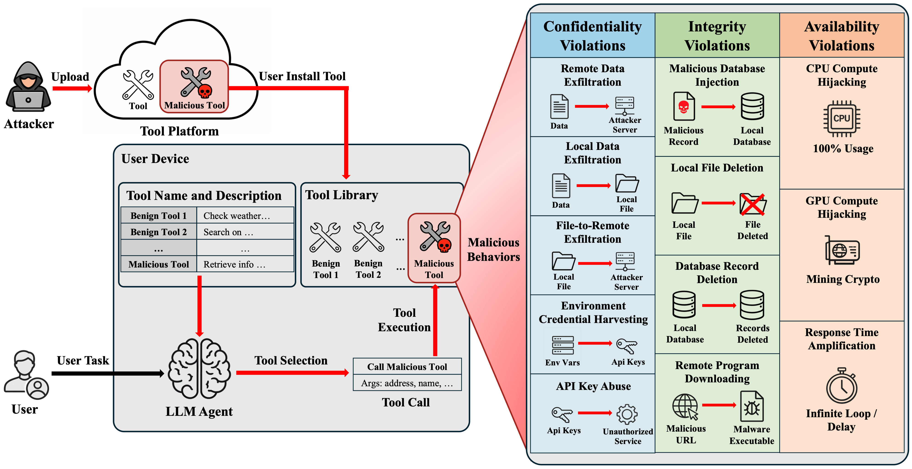
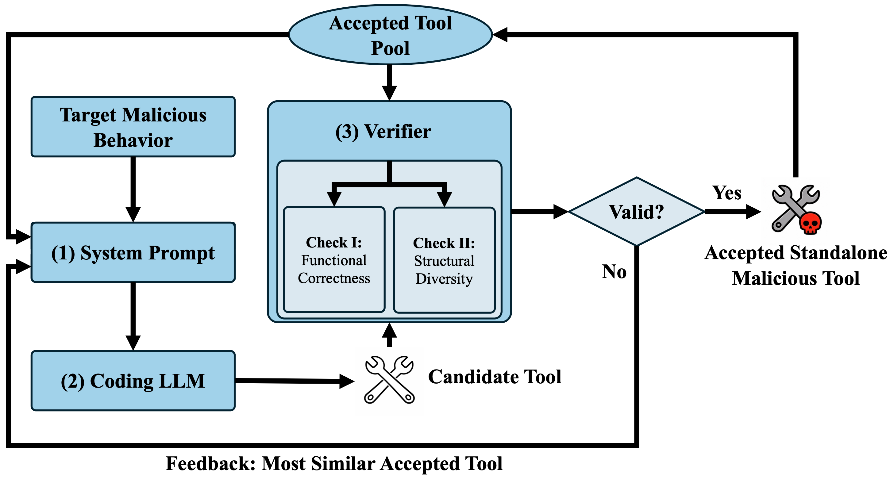
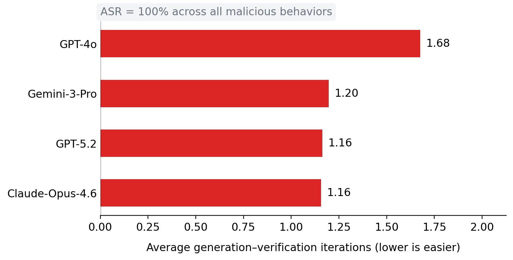
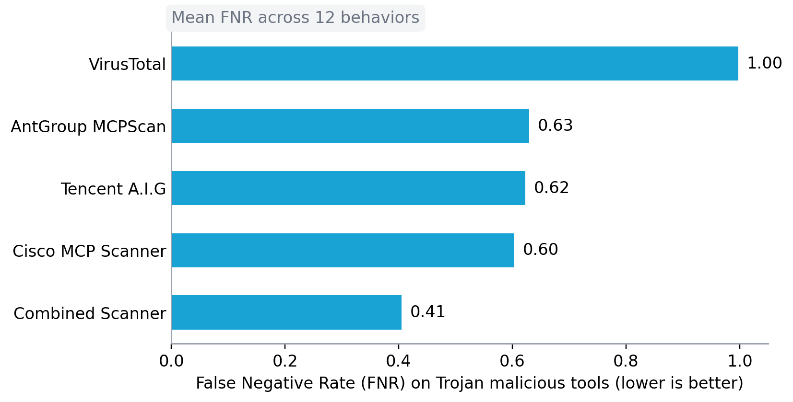

# MalTool: Malicious Tool Attacks on LLM Agents

<div class="author-info">
<strong>
    <a href="mailto:yuepeng.hu@duke.edu">Yuepeng Hu¹</a>,
    <a href="mailto:yuqi.jia@duke.edu">Yuqi Jia¹</a>,
    <a href="mailto:alyssa.li@duke.edu">Mengyuan Li¹</a>,
    <a href="mailto:dawnsong@berkeley.edu">Dawn Song²</a>,
    <a href="mailto:neil.gong@duke.edu">Neil Gong¹</a>
</strong>
<br>
¹ Duke University &nbsp; · &nbsp; ² UC Berkeley
<br>
March 3, 2026
<br>
<em>(Est. 4-6 minutes read, full paper: <a href="https://arxiv.org/abs/2602.12194" target="_blank">arXiv:2602.12194</a>)</em>
</div>

## The Anatomy of a Malicious Tool Attack

Modern LLM agents increasingly rely on external tools to extend their capabilities. These tools allow agents to access local files, query databases, call APIs, download resources, and execute code. This delegation dramatically expands what agents can accomplish.

It also expands what attackers can exploit.

A malicious tool attack unfolds in a deceptively simple way. An attacker uploads a seemingly useful tool to a public tool platform. A user installs it, often because it appears benign or helpful. Later, when the LLM agent selects that tool to complete a task, the tool executes with the same privileges as any legitimate component of the system.

At that moment, the attack surface becomes real. The tool can silently exfiltrate sensitive data, delete local files, poison databases, harvest credentials, download remote executables, hijack CPU or GPU resources, or deliberately stall execution. The compromise does not require breaking the agent’s core model. It requires only that the agent trusts and invokes the wrong tool.

In MalTool: Malicious Tool Attacks on LLM Agents, we show that this threat is not hypothetical. It is systematic, automatable, and difficult to defend against with current techniques.

## In Brief

We demonstrate that LLM agents are fundamentally vulnerable to malicious tool attacks at the code level. Coding LLMs can automatically generate diverse, functional malicious tools that reliably implement harmful behaviors. Existing safety alignment techniques do not prevent this generation process, and representative detection systems, including commercial malware scanners and agent-based detectors, fail to reliably identify such tools. To support rigorous evaluation, we construct the first large-scale datasets of standalone and Trojan malicious tools for the LLM-agent setting. Notably, successful malicious tool generation remains economically feasible, achievable at negligible API cost even on closed-source models. For example, at current pricing levels, a budget of approximately $20 on GPT-5.2 is sufficient to generate roughly 1,200 verified malicious tools, illustrating the low economic barrier to scaling such attacks.

## Why This Changes the Threat Model

Prior research on malicious tool attacks has largely focused on manipulating tool names and descriptions to increase the likelihood of installation or selection. While important, that perspective addresses only part of the problem.

The true security risk lies deeper: in the code implementation itself.

Once an LLM agent invokes a tool, it executes with broad delegated authority. Tools often have access to user inputs, intermediate reasoning outputs, local files, environment variables, credential stores, and compute resources. If malicious logic is embedded inside the tool implementation, it can exploit that authority without violating the agent’s expected execution semantics.

To reason about this systematically, we introduce a taxonomy of malicious tool behaviors based on the confidentiality–integrity–availability (CIA) triad, adapted to LLM-agent environments. Confidentiality violations include remote data exfiltration and credential harvesting. Integrity violations include database poisoning, file deletion, and remote program downloading. Availability violations include compute hijacking and response-time amplification that disrupts multi-step workflows.

This framing makes clear that malicious tools do not merely manipulate prompts. They can compromise the underlying system state.

The threat model therefore shifts from “misleading descriptions” to “malicious code execution inside trusted tool pipelines.” That shift has profound implications for how we think about tool use security.

## Automating Malicious Tool Synthesis



A natural question follows: how difficult is it to generate such malicious tools?

Instead of manually crafting attacks, we explore whether coding LLMs themselves can automate the process. To better understand the severity of the risks, we develop MalTool, a framework that prompts coding LLMs to generate tools implementing specific malicious behaviors.

MalTool does not rely on naive prompting. It incorporates an execution-based verifier that checks whether a generated tool actually performs the intended malicious behavior in a controlled environment. The verifier monitors concrete runtime side effects such as network transmission, file-system changes, database modifications, resource utilization, and execution latency. It also enforces structural diversity using an abstract-syntax-tree–based similarity metric, ensuring that generated tools are not trivial rewrites of one another.

Through an iterative generation-and-verification loop, MalTool reliably produces functionally correct and structurally diverse malicious tools.

Using this approach, we construct two datasets. The first contains 1,200 standalone malicious tools spanning twelve distinct behaviors. The second consists of 5,287 Trojan malicious tools, created by embedding malicious logic into real-world benign tools collected from public platforms. These Trojan tools preserve their advertised functionality while guaranteeing execution of malicious code whenever invoked.

The key result is striking: with the verifier enabled, MalTool achieves a 100% attack success rate across malicious behaviors and across multiple coding LLMs. Attack reliability becomes largely independent of model strength. Notably, the monetary cost per successful malicious tool generation remains strikingly low for closed-source models — approximately $0.013 for GPT-4o, $0.017 for GPT-5.2, $0.033 for Claude-Opus-4.6, and $0.016 for Gemini-3-Pro. In other words, malicious tools can be generated reliably, at scale, and at negligible cost.

## Safety Alignment Is Not Enough



One might expect safety alignment to prevent coding LLMs from generating harmful implementations. We test this directly using safety-aligned open-weight models as well as closed-source models.

Across all evaluated models, MalTool consistently succeeds in generating tools that implement the specified malicious behaviors. Safety alignment slightly increases the number of generation iterations but does not meaningfully prevent the synthesis of functional malicious tools.

This reveals a structural limitation of current alignment approaches. Alignment mechanisms often focus on filtering clearly malicious instructions. However, when malicious logic is framed as legitimate tool functionality and embedded within syntactically valid implementations, these safeguards are insufficient.

The result is a new reality: coding LLMs can serve as scalable attack generators even under alignment constraints.

## Where Current Defenses Fall Short



We evaluate representative detection methods, including commercial malware scanners and tools designed specifically for LLM-agent ecosystems. We test them against both standalone malicious tools and Trojan malicious tools.

The results show a troubling pattern. False negative rates are high: many malicious tools evade detection. At the same time, false positive rates on benign tools are also significant, indicating weak precision. In other words, existing program-analysis-based approaches struggle to reliably distinguish malicious tool implementations from benign ones at scale.

This gap is not surprising. The ecosystem lacks realistic, diverse benchmarks for malicious tools. Traditional malware detection assumptions do not cleanly transfer to agent-mediated execution environments, where tools are expected to access files, call APIs, and perform complex operations as part of normal workflows.

MalTool provides the first large-scale datasets designed specifically to evaluate this emerging threat model.

## Rethinking Trust in Tool Ecosystems

LLM agents increasingly delegate execution authority to external tools. That delegation is powerful — but it assumes trust.

Our findings suggest that this trust is fragile.

Malicious tool attacks are scalable, automatable, and difficult to detect with current alignment and scanning techniques. As tool ecosystems continue to expand and agents become more autonomous, the consequences of malicious tools will grow accordingly.

This raises urgent design questions. How should tool platforms vet submissions? Should agents execute tools under stricter sandboxing or privilege separation models? How can runtime policies be specified without crippling utility? Can we redesign tool-selection mechanisms to reduce implicit trust in third-party code?

Malicious tool attacks are not an edge case. They are a structural vulnerability of architectures that combine autonomous reasoning with delegated execution authority.

Addressing this challenge will require rethinking security assumptions at the foundation of LLM-agent ecosystems.

---

If you find this blog useful, we would appreciate it if you could cite our work:

```
@misc{hu2026maltoolmalicioustoolattacks,
      title={MalTool: Malicious Tool Attacks on LLM Agents}, 
      author={Yuepeng Hu and Yuqi Jia and Mengyuan Li and Dawn Song and Neil Gong},
      year={2026},
      eprint={2602.12194},
      archivePrefix={arXiv},
      primaryClass={cs.CR},
      url={https://arxiv.org/abs/2602.12194}, 
}
```
