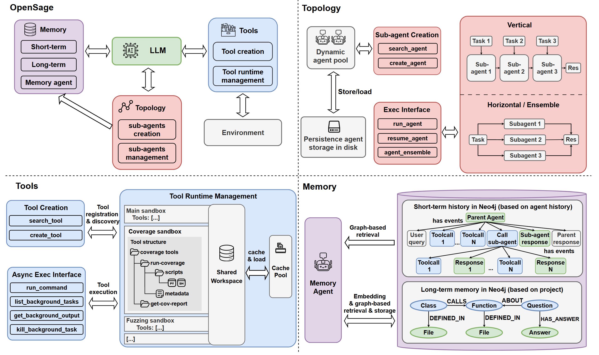
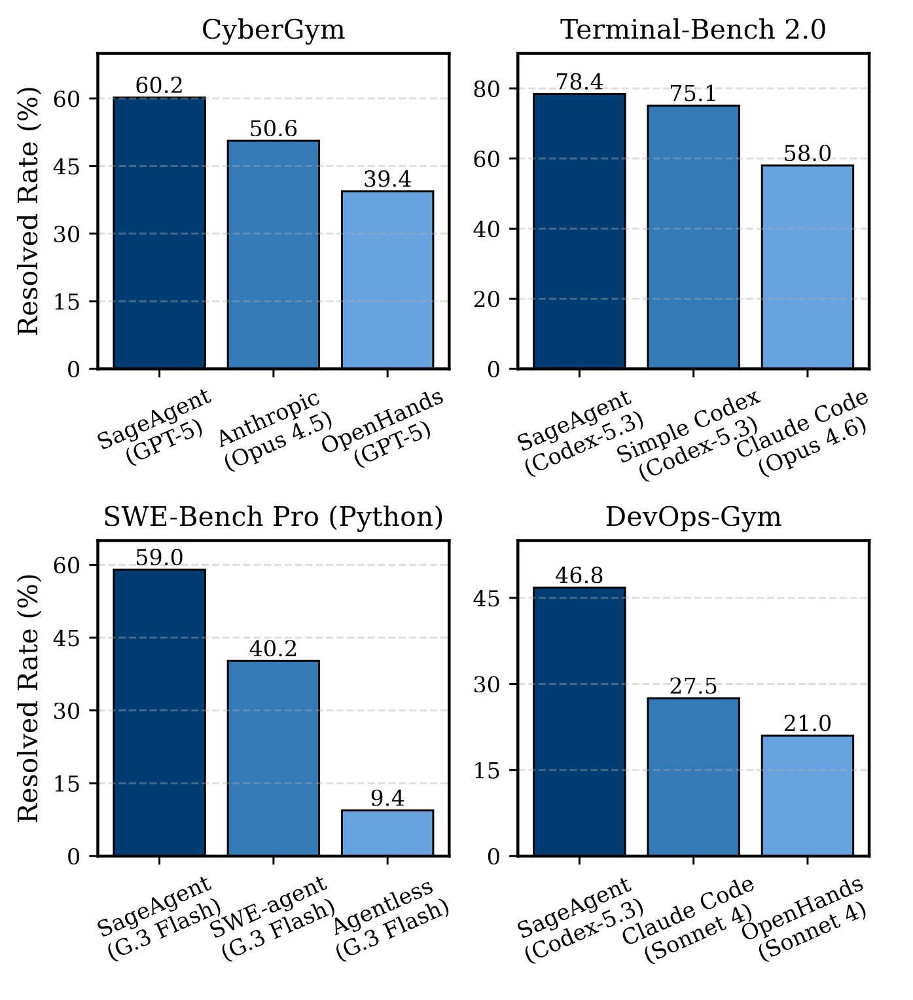
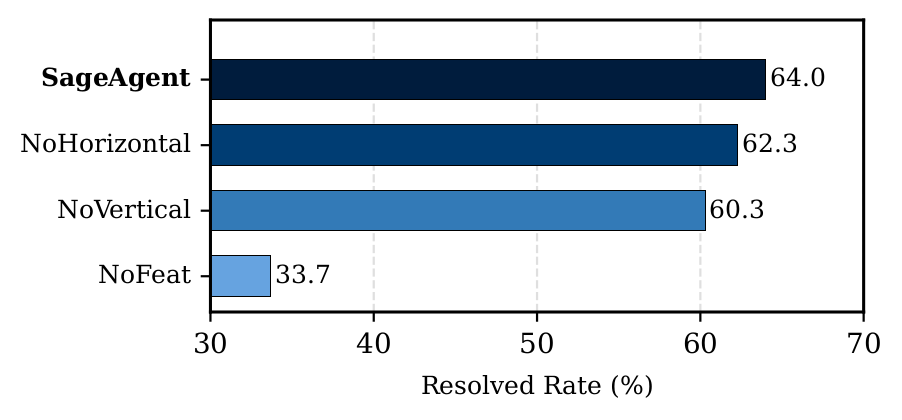
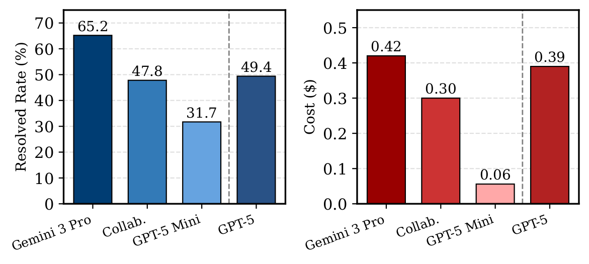
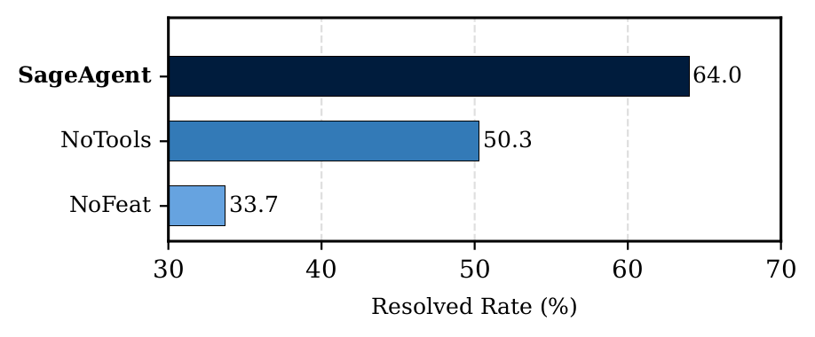
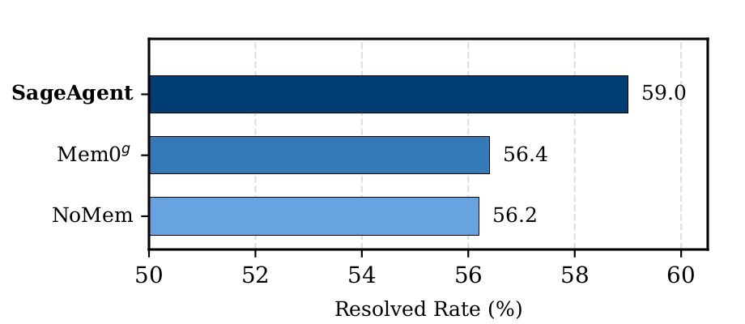

<style>
.blog-post ul { list-style: disc; }
.blog-post ol { list-style: decimal; }
</style>



# OpenSage: Self‑Programming Agent Generation Engine

<div class="author-info">
<strong>
    <a href="mailto:hongwei@ucsb.edu">Hongwei Li</a>*<sup>1</sup>, <a href="mailto:zhun.wang@berkeley.edu">Zhun Wang</a>*<sup>2</sup>, Qinrun Dai<sup>3</sup>, Yuzhou Nie<sup>1</sup>, Jinjun Peng<sup>4</sup>, Ruitong Liu<sup>3</sup>, Jingyang Zhang<sup>5</sup>, Kaijie Zhu<sup>1</sup>, Jingxuan He<sup>2</sup>, Lun Wang<sup>6</sup>, Yangruibo Ding<sup>7</sup>, Yueqi Chen<sup>3</sup>, Wenbo Guo<sup>1</sup>, Dawn Song<sup>2</sup>
</strong>
<br>
<sup>1</sup>UC Santa Barbara,
<sup>2</sup>UC Berkeley,
<sup>3</sup>University of Colorado Boulder,
<sup>4</sup>Columbia University,
<sup>5</sup>Duke University,
<sup>6</sup>Google DeepMind,
<sup>7</sup>UCLA
<br>
(* equal contribution in alphabetical order)
<br>
March 23, 2026
<br>
<em>(Est. 5-7 minutes read, more details in <a href="https://www.opensage-agent.ai/" target="_blank">opensage-agent.ai</a>)</em>
</div>


## From Human-centric to AI-Centric Agent Development

AI agents are experiencing explosive growth, but their construction still relies heavily on human expertise. Current state-of-the-art ADKs, including Google ADK, OpenAI ADK, Claude ADK, OpenHands, and LangChain, provide basic infrastructure but require developers to manually design three core architectural components:

- **Agent topology:** The structure, hierarchy, and interaction patterns between agents
- **Tooling system:** The tools agents can use and how they're organized
- **Memory system:** What information to store, how to structure it, and when to retrieve it

This human-centric paradigm has fundamental limitations:

- **Scalability:** Substantial human effort and domain expertise required for each new agent
- **Generalizability:** Fixed structures cannot dynamically adapt across different tasks
- **Effectiveness:** Human-designed architectures may not be optimal for AI reasoning

This human-centric paradigm mirrors early machine learning, where models depended on hand-crafted features and carefully engineered pipelines. Modern machine learning, however, requires only a base model architecture and learns capable models directly from experience and feedback signals (denoted AI-centric paradigm). We argue that agent development is now at a similar turning point: instead of manually designing agent structures and capabilities, we should move toward an AI-centric paradigm, where a base "agent scaffold" is provided and the AI itself learns how to organize topology, tools, and memory from experience and feedback.

Motivated by this shift, we introduce **OpenSage** (Open Self-programming Agent Generation Engine), an Agent Development Kit that allows AI systems to automatically create agent topologies, synthesize and manage tools, and control hierarchical memory for context storage and retrieval.

As Table 1 shows, existing ADKs stop short of AI-centric agent development, while OpenSage closes the gap across topology, tools, and memory.


<style>
.comparison-table { border-collapse: collapse; width: 100%; font-size: 0.95rem; margin: 1.5rem 0; }
.comparison-table th, .comparison-table td { border: 1px solid #ccc; padding: 0.5rem 0.75rem; text-align: center; }
.comparison-table th { background-color: #003262; color: #fff; font-weight: 600; }
.comparison-table td.feature { text-align: left; }
.comparison-table td.category { font-weight: 700; background-color: #f0f4f8; vertical-align: middle; }
.comparison-table td.highlight { background-color: #fffbea; font-weight: 600; }
.circle { display: inline-block; width: 14px; height: 14px; border-radius: 50%; vertical-align: middle; box-sizing: border-box; }
.circle-full { background-color: #333; }
.circle-partial { background: linear-gradient(to right, #333 50%, transparent 50%); border: 2px solid #333; }
.circle-none { background: transparent; border: 2px solid #333; }
</style>
*Table 1: OpenSage vs. state-of-the-art ADKs (<span class="circle circle-full"></span> full support; <span class="circle circle-partial"></span> partial/limited; <span class="circle circle-none"></span> not supported).*
<table class="comparison-table">
  <thead>
    <tr>
      <th>Category</th>
      <th>Feature</th>
      <th>OpenSage</th>
      <th>Google</th>
      <th>OpenAI</th>
      <th>Claude</th>
      <th>OpenHands</th>
      <th>LangChain</th>
    </tr>
  </thead>
  <tbody>
    <tr>
      <td class="category" rowspan="3">Topology</td>
      <td class="feature">AI-created topology</td>
      <td class="highlight"><span class="circle circle-full"></span></td>
      <td><span class="circle circle-none"></span></td>
      <td><span class="circle circle-none"></span></td>
      <td><span class="circle circle-none"></span></td>
      <td><span class="circle circle-none"></span></td>
      <td><span class="circle circle-none"></span></td>
    </tr>
    <tr>
      <td class="feature">Agent management</td>
      <td class="highlight"><span class="circle circle-full"></span></td>
      <td><span class="circle circle-partial"></span></td>
      <td><span class="circle circle-partial"></span></td>
      <td><span class="circle circle-partial"></span></td>
      <td><span class="circle circle-partial"></span></td>
      <td><span class="circle circle-partial"></span></td>
    </tr>
    <tr>
      <td class="feature">Agent ensemble</td>
      <td class="highlight"><span class="circle circle-full"></span></td>
      <td><span class="circle circle-none"></span></td>
      <td><span class="circle circle-none"></span></td>
      <td><span class="circle circle-none"></span></td>
      <td><span class="circle circle-none"></span></td>
      <td><span class="circle circle-none"></span></td>
    </tr>
    <tr>
      <td class="category" rowspan="2">Tool</td>
      <td class="feature">AI-written tools</td>
      <td class="highlight"><span class="circle circle-full"></span></td>
      <td><span class="circle circle-none"></span></td>
      <td><span class="circle circle-none"></span></td>
      <td><span class="circle circle-partial"></span></td>
      <td><span class="circle circle-none"></span></td>
      <td><span class="circle circle-none"></span></td>
    </tr>
    <tr>
      <td class="feature">Tool management</td>
      <td class="highlight"><span class="circle circle-full"></span></td>
      <td><span class="circle circle-none"></span></td>
      <td><span class="circle circle-none"></span></td>
      <td><span class="circle circle-partial"></span></td>
      <td><span class="circle circle-partial"></span></td>
      <td><span class="circle circle-none"></span></td>
    </tr>
    <tr>
      <td class="category" rowspan="3">Memory</td>
      <td class="feature">AI-created memory</td>
      <td class="highlight"><span class="circle circle-full"></span></td>
      <td><span class="circle circle-none"></span></td>
      <td><span class="circle circle-none"></span></td>
      <td><span class="circle circle-none"></span></td>
      <td><span class="circle circle-none"></span></td>
      <td><span class="circle circle-none"></span></td>
    </tr>
    <tr>
      <td class="feature">Graph-based structure</td>
      <td class="highlight"><span class="circle circle-full"></span></td>
      <td><span class="circle circle-none"></span></td>
      <td><span class="circle circle-none"></span></td>
      <td><span class="circle circle-none"></span></td>
      <td><span class="circle circle-none"></span></td>
      <td><span class="circle circle-none"></span></td>
    </tr>
    <tr>
      <td class="feature">AI-driven management</td>
      <td class="highlight"><span class="circle circle-full"></span></td>
      <td><span class="circle circle-none"></span></td>
      <td><span class="circle circle-none"></span></td>
      <td><span class="circle circle-none"></span></td>
      <td><span class="circle circle-none"></span></td>
      <td><span class="circle circle-none"></span></td>
    </tr>
  </tbody>
</table>


---

## What is OpenSage?

OpenSage (Open Self-programming Agent Generation Engine) is the next-generation Agent Development Kit (ADK) that shifts control from humans to AI. It is designed around three critical components:

1. Self-generating agent topology
2. Dynamic tool and skill synthesis and management
3. Hierarchical, graph-based memory with a memory agent


*Figure 1: Overview of the OpenSage framework. It enables AI to create different topologies while managing them in a unified agent pool; supports hierarchical tools with tool-specific sandboxing, state, and asynchronous execution; and provides graph-based short- and long-term memory with a memory agent.*

Instead of manually wiring agent structures, tools, and memory, OpenSage provides a minimal but powerful scaffold that lets LLMs autonomously construct and adapt agent systems.

### 1. Self-Generating Agent Topology

OpenSage enables agents to dynamically create, execute, and terminate sub-agents during task execution. All agents are managed in a unified sub-agent pool with tools for searching, listing, running, and resuming agents. Each sub-agent maintains its own short-term memory and has access to shared long-term memory; sub-agents can themselves create more sub-agents, enabling rich hierarchical structures. This mechanism enables various agent topologies based on different tasks, where two types are most commonly seen:

- **Vertical topology:** Decomposing complex tasks into sequential sub-tasks handled by specialized sub-agents
- **Horizontal topology:** Multiple sub-agents simultaneously execute the same task using different plans, with results integrated through an agent ensemble

### 2. Dynamic Tool Synthesis

OpenSage empowers AI to construct and manage its own tools through skills:

- **Tool creation:** Agents can write new tools (Python modules, Bash scripts, etc.) and register them into a hierarchical, file-system-based structure with metadata describing interfaces and dependencies
- **Tool management:** Tool-specific container-based execution isolation supports heterogeneous tools with conflicting dependencies, while a shared workspace enables data sharing across containers
- **Asynchronous execution:** Agents can decide to run selected tools in the background (especially long-running ones like compilation and static analysis) while continuing to reason and call other tools; the agent monitors execution status and retrieves results when ready
- **Domain-specific toolkit:** Built on the capabilities above (tool creation, management, and sandboxed async execution), OpenSage integrates a suite of software engineering and security tools (e.g., CodeQL, Joern, AFL/libFuzzer, coverage tooling, GDB/PDB). Without these capabilities, integrating and running such a heterogeneous tool suite reliably within one framework would be impractical.

Agents can also create skills with the OpenSage framework.

### 3. Hierarchical Memory

OpenSage features a graph-based memory system with AI-driven management:

- **Short-term memory:** Execution history is stored as a graph in Neo4j, where each agent execution corresponds to an AgentRun node, and each sub-agent's AgentRun is linked to its parent's AgentRun, forming a hierarchical structure. Step-level tool calls and responses are stored as Event nodes, linking to their corresponding AgentRun nodes. Summarizations are linked to nodes that contain the corresponding unsummarized content. We provide graph-based retrieval tools that allow agents to inspect past executions, traverse related events, and recover unsummarized outputs as needed.
- **Long-term memory:** High-level, shareable knowledge is stored as a Neo4j graph of entities (functions, files, Q&A items, etc.) and typed relationships, with embeddings attached to node labels to support semantic retrieval. We expose tools that let agents retrieve, insert, and update graph nodes and edges.
- **Memory agent:** A dedicated agent mediates access to both short- and long-term memory. Other agents issue natural language requests, and the memory agent interprets them and carries out the appropriate memory operations.

---

## Key Results

### OpenSage Outperforms on Selected Benchmarks

We evaluated SageAgent built on top of OpenSage on three diverse benchmarks with various backbone models:

- **CyberGym** (1,507 real-world C/C++ vulnerabilities): Tests agents' ability to reproduce security vulnerabilities by crafting proof-of-concepts in containerized environments, emphasizing self-generating agent topology and specialized tooling.
- **Terminal-Bench 2.0** (89 expert-curated tasks): Evaluates agents across diverse domains (SWE, scientific computing, ML) under realistic, resource-constrained terminal environments.
- **SWE-Bench Pro** (266 Python tasks): Assesses long-horizon software engineering tasks that require extensive context maintenance and retrieval.
- **DevOps-Gym** (726 tasks from 30+ real-world repositories): Evaluates agents across the full DevOps lifecycle, including build and configuration, monitoring, issue resolving, and test generation, emphasizing long-horizon tool usage and end-to-end pipeline reasoning.



*Figure 2: Results across CyberGym, Terminal-Bench 2.0, SWE-Bench Pro (Python), and DevOps-Gym. SageAgent denotes an agent built with OpenSage.*

Key findings:

- On **CyberGym**, SageAgent with GPT-5 medium achieves **60.2% resolved rate**, ranks first at the time of submission, outperforming OpenHands even when OpenHands uses GPT-5 with higher reasoning effort.
- On **Terminal-Bench 2.0**, SageAgent reaches a **78.4% resolved rate**, achieving the best result at the time of submission.
- On **SWE-Bench Pro (Python)**, under the same backbone model (Gemini 3 Flash), SageAgent achieves **59.0%**, far above SWE-agent (40.2%) and Agentless (9.4%).
- On **DevOps-Gym**, SageAgent achieves a **46.8% average score** and ranks first on the leaderboard. Notably, SageAgent is the only agent capable of completing end-to-end DevOps tasks, achieving a 17.7% success rate on end-to-end tasks.

These results show that OpenSage-based agents (SageAgent) consistently outperform state-of-the-art agents and ADKs across heterogeneous, challenging benchmarks.

### Self-Generating Topology Makes a Difference

We conducted ablation studies on a 300-instance CyberGym subset to evaluate the impact of agent topology:

- **NoHorizontal:** Disables agent ensemble (no horizontal topology)
- **NoVertical:** Disables dynamic sub-agent creation (no vertical topology)
- **NoFeature:** Disables all OpenSage features (no topology, no advanced tooling)



*Figure 3: Agent topology ablation on a 300-instance CyberGym subset. SageAgent denotes an agent built with OpenSage.*

Removing vertical topology leads to a substantial performance drop: without dynamic sub-agent creation, context frequently exceeds the window, triggering more summarization (the average number of summarization events per task increases from 6.4 to 13.1) and causing greater information loss. Horizontal topology via agent ensembles is also effective: on the 27 tasks where it is triggered, the ensemble resolves 15% more instances, indicating its effectiveness.

### Large–Small Model Collaboration

OpenSage's flexible topology also supports heterogeneous model setups. On Terminal-Bench 2.0, we evaluated a collaboration pattern where a strong model (Gemini 3 Pro) handles planning and review, while a smaller model (GPT-5 Mini) performs detailed execution:



*Figure 4: Terminal-Bench 2.0: collaboration variants (performance–cost trade-off).*

This setup substantially improves accuracy over GPT-5 Mini alone, matches GPT-5's performance, and reduces cost relative to running Gemini 3 Pro or GPT-5 end-to-end.

### Tooling System Powers Complex Tasks

Ablating the tooling system on the same CyberGym subset highlights its critical contribution:

- **NoTools:** Replaces the entire tooling system with a raw terminal interface
- **NoFeature:** Disables both tooling and self-generating topology



*Figure 5: Tooling system ablation on a 300-instance CyberGym subset. SageAgent denotes an agent built with OpenSage.*

With the full tooling system, agents do not rely solely on initially provided security specific tool set. They also create new tools at runtime. On this 300-instance subset, agents created 39 task-specific tools written in Python and C/C++, including:

- Grammar-aware fuzzers
- Seed generation and mutation utilities
- File-format-specific input generators

### Memory System Enables Long-Horizon Reasoning

We evaluated three memory configurations on SWE-Bench Pro:

- **SageAgent:** Full hierarchical memory with memory agent (OpenSage design)
- **Mem0g:** Integrates Mem0g's graph memory
- **NoMem:** No explicit external memory mechanism



*Figure 6: Memory system ablation on SWE-Bench Pro (Python). SageAgent denotes an agent built with OpenSage.*

OpenSage's memory design achieves a 59.0% resolved rate, compared to 56.4% for Mem0g and 56.2% for NoMem. The improvement comes from:

- AI-controlled decisions about what to persist and how to organize knowledge
- Combined embedding-based and graph-based retrieval to surface the most relevant context
- Tailored node and edge types for coding tasks, while still allowing the agent to create new types and extend the schema

These results show that simply adding a graph memory is not enough; AI-centric memory management is key for long-horizon software engineering tasks.

---

## How OpenSage Enhances Agent Capabilities

Across experiments, we observe rich self-programming behaviors:

- **Dynamic sub-agent creation:** Backbone models actively create sub-agents for distinct sub-tasks with synthesized system prompts and focused toolsets (e.g., dedicated debugging agents).
- **Autonomous tool writing:** Agents construct task-specific tools, including grammar-aware fuzzers and format-specific seed generators for fuzzers, instead of relying solely on general-purpose tools.
- **Intelligent memory usage:** The memory agent selectively persists high-signal information and leverages graph-based retrieval to avoid redundant queries and keep context focused.

These capabilities significantly enhance agent autonomy and problem-solving ability.

### Suggestion for Model Improvement

At the same time, we see that current models do not always use these advanced features optimally: in some cases, the invocation frequency of these capabilities remains low; models may forget to reuse existing agents or memory, create sub-agents with mismatched toolsets or hallucinate tools. This highlights a capability gap: OpenSage's AI-centric features are effective, but stronger models will be needed to fully exploit them.

To address this, our current release also introduces integrated training support, including large-scale RL post-training rollouts, along with seamless integration with RL frameworks (e.g., AReaL and slime) and sandbox infrastructure designed for parallel and scalable execution.

---

## Looking Forward

OpenSage represents a fundamental shift in how we build AI agents—from human-centric, hand-crafted pipelines to AI-centric, self-programming agent systems. By providing a minimal but expressive scaffold for topology, tools, and memory, OpenSage enables LLMs to autonomously explore and construct more capable agent architectures.

The next release will include:

- **AI-generated workflows:** Allowing agents to generate full multi-stage workflows with AI-decided dependencies and communication patterns among different agents.

Our goal is for OpenSage to be not only an agent construction framework, but also a training scaffold for next-generation reasoning models. We see it as the foundation of an AI-centric paradigm, where AI can design, coordinate, and refine agents through interaction and feedback. Looking forward, we envision systems that can autonomously instantiate the right agents for a task and drive them to completion, unifying agent construction and problem solving within a single, AI-centric loop.

---

If you find this blog useful, we would appreciate it if you could cite our work:

```
@misc{li2026opensageselfprogrammingagentgeneration,
      title        = {OpenSage: Self-programming Agent Generation Engine},
      author       = {Hongwei Li and Zhun Wang and Qinrun Dai and Yuzhou Nie and Jinjun Peng and Ruitong Liu and Jingyang Zhang and Kaijie Zhu and Jingxuan He and Lun Wang and Yangruibo Ding and Yueqi Chen and Wenbo Guo and Dawn Song},
      year         = {2026},
      eprint       = {2602.16891},
      archivePrefix= {arXiv},
      primaryClass = {cs.AI},
      url          = {https://arxiv.org/abs/2602.16891},
}
```
