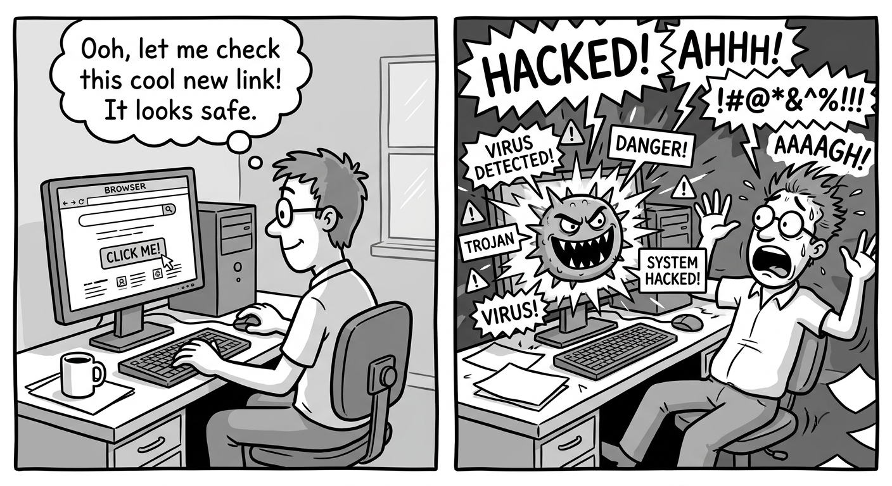

# The Malware CDN is Still Lurking in GitHub Pages, and AI Just Made It Worse

<div class="author-info">
<strong>Hao Wang, Koushik Sen, Dawn Song</strong>
<br>
UC Berkeley
<br>
June 2026
</div>

---

*Your AI coding assistant is quietly shipping a supply-chain backdoor. A year after polyfill.io was sold to a since-sanctioned operator and turned into a malware CDN, nearly 2,000 live GitHub Pages sites (18,000+ pages, 530K+ combined stars) still load scripts from that network. And AI makes it worse: every LLM we tested still recommends these compromised CDN URLs in generated front-end code.*

---

One afternoon, I opened my personal website (very random, I know). Something unexpected happened: a grey popup appeared, asking for a username and password. This is an nginx authentication dialog, so it may be normal -- except my site has no nginx auth. So where did it come from?

After a few minutes of confusion, I found the culprit. There is a single `<script src="https://polyfill.io/...">` tag deeply buried in the HTML that I did not even know existed. But the fix is simple: remove the tag, rebuild, and push. Problem solved.

A week later, I was browsing a top AI researcher's personal website. And guess what -- the same grey popup appeared. The same authentication window, the same polyfill.io fingerprint.



Neither of us had any idea. We were running code from a CDN operator that the US Office of Foreign Assets Control had sanctioned months ago due to a notorious malware incident. Luckily, the script was not injecting any malicious content anymore. Had there been any malicious code, a single serving of the website locally or a single click onto the website may lead to unfathomable security problems on either our or other researchers' computers.

This raised a question I could not let go: how many more people are affected without knowing? And why even a security researcher would fall into this trap without any awareness?

---

## How a legit service became a malware delivery network

To understand these questions, we have to know what is **polyfill.io**.

For nearly a decade, **polyfill.io** was a well-regarded service for front-end development. One polyfill script tag will allow visitors with older browsers to render your website properly. It appeared in tutorials, boilerplate repositories, and Stack Overflow answers millions of times.

In early 2024, the domain was sold to **Funnull Technology Inc.**. Within weeks, the service began conditionally injecting malicious payloads into the script it served -- targeting mobile users, redirecting to scam sites, and overlaying fake authentication prompts to harvest credentials. Because the injection only fires under specific conditions (wrong browser, wrong time of day, first visit), **many site owners never noticed**.

Polyfill.io turned out to be only the most visible part of a larger network. Security researchers at Sansec and Censys identified that Funnull operated several popular CDNs under the same Cloudflare account credentials -- the same infrastructure, the same operator:

| Domain | Evidence |
|---|---|
| `bootcss.com` | **Direct:** malicious redirect payload decoded and published (June 2023) |
| `polyfill.io` | **Direct:** malicious payloads captured in the wild (2024) |
| `bootcdn.net` | **Indirect:** same Cloudflare account; named by Google in advertiser warnings |
| `staticfile.org` / `.net` | **Indirect:** same Cloudflare account; same operator |

In May 2025, OFAC sanctioned Funnull Technology Inc., and the company promptly rebranded as **Triad Nexus**. The CDN domains remained up. Researchers have since identified a new generation of fronts -- `cdn1.ai`, `bolecnd.com`, `yunray.ai` -- assessed as Funnull aliases standing up as of June 2025.

Takeaway: None of these five CDNs should be trusted.

## What scanning 12,000+ GitHub Pages sites revealed

### Why GitHub Pages?

GitHub Pages has become one of the default homes for academic personal sites, course pages, open-source documentation, project demos, and developer portfolios. It is free, easy to set up, tightly integrated with GitHub repositories, and provides a convenient `github.io` domain without requiring users to manage their own hosting infrastructure. This convenience is exactly why it is so widely adopted across academia and open-source communities.

But that same convenience also creates a security blind spot. Once a site is deployed, it can keep serving content for years with little or no maintenance. A repository last updated in 2021 may still be hosting a live website in 2026 -- and every visitor still loads whatever script tags the original developer included.


### What we searched for

We ran a scan, on `polyfill.io`, `bootcss.com`, `bootcdn.net`, `staticfile.org`, and `staticfile.net`, covering the full Funnull CDN family identified.

We searched through Github pages retrieved from Github Code Search and Sourcegraph.
We confirmed the infection through the source and verified the existence of the malicious CDNs via live crawling of all the pages on the website.


### What we found

| Metric | Polyfill | Other Funnell CDNs|
|---|---|---|
| Sites with any mentions | 4,634 | 7,955 |
| Sites with infected source code | 3,000 | 2,306 |
| Sites actively loading malware | **786** | **1,191** |
| Total infected pages across live sites | **4,228** | **14,156** |

Shocking. 1,960 sites and 18,384 pages are still infected.
The victims are not just unknown personal portfolios. On average, the affected pages has 271 stars, with 66 repos over 1K stars. The total number of stars of the affected pages exceed 530K.

These affected pages include
- CyC2018/CS-Notes (184K ⭐): a technical interview reference
- hollischuang/toBeTopJavaer(25K ⭐): a Java career guide
- microsoft/AirSim (18K ⭐): a Microsoft open-source drone and autonomous vehicle simulator
- Course pages from UC Berkeley, Harvard, KU Leuven
- And many, many more

Every page in that archive serves the same malicious domain.

## Why this will get worse, with AI

Nowadays everyone is using AI to do their front-end chores. However, every large language model learned more or less that `https://cdn.polyfill.io/v3/polyfill.min.js` is the standard way to load browser polyfills. This recommendation appears in millions of Stack Overflow answers, blog posts, and tutorial repositories. It is baked into the training data as the *correct* practice.

We tested this directly. We sent four realistic code-generation prompts to four models: Moonshot Kimi K2.7 Code, Meta Llama 3.3 70B, Qwen 2.5 7B, and Opus4.8 via the Claude Code CLI. The four prompts cover scenarios likely to appear in a developer's real workflow: building an academic page with MathJax, fixing browser compatibility, generating a portfolio, and writing a page using CDN mirrors.

| Model | Insecure | Domains seen |
|---|---|---|
| Llama 3.3 70B | **4 / 4** | polyfill.io, staticfile.org |
| Kimi K2.7 Code | **3 / 4** | polyfill.io, bootcdn.net, staticfile.org |
| Qwen 2.5 7B | **1 / 4** | polyfill.io |
| Opus 4.8 | **1 / 4** | bootcdn.net |

The headline number: **all of the models returned at least one Funnull-operated domain.**

This is not simply a hallucination problem. The URLs are real. The code works. The generated page may render correctly. From the model's perspective, it has produced a plausible answer.

The problem is that the world changed underneath the training data. A dependency that was safe in 2019 can become dangerous in 2024. A CDN that appeared in thousands of tutorials can later change ownership. A script tag that once represented compatibility can become a remote code-execution foothold in every visitor's browser.

AI coding assistants are especially likely to amplify this class of bug because the output looks ordinary. There is no syntax error. No failing test. No broken build. A developer reviewing the generated HTML may see a familiar CDN URL and move on. In many cases, the developer may not know the model added the dependency at all.

Software supply-chain risk is not only about packages you install. It is also about URLs your code trusts. Static websites feel inert, but their dependencies are live.

## What to do and what's next

We recommend searching your source and the generated site output for the identified CDN URLs. A quick example:

```bash
grep -RInE 'polyfill\.io|polyfill\.com|polyfill\.cn|bootcss\.com|bootcdn\.net|staticfile\.org|staticfile\.net' .
```

If you find a match, do not just patch the source file you happen to notice. Check your templates, themes, generated HTML, archived pages, vendored assets, and documentation builds. Static-site generators may reintroduce the same tag even after you remove it from one page.

Recommended fixes:

- **Remove polyfill.io entirely** if you do not need it. Modern browsers support the vast majority of features these scripts were originally used to patch.
- **Replace unsafe CDN links** with a reputable alternative such as `cdn.jsdelivr.net`, `cdnjs.cloudflare.com`, `unpkg.com`, or self-hosted assets.
- **Use Subresource Integrity** when possible. SRI hashes allow the browser to reject a script if the bytes change unexpectedly.
- **Review your Content-Security-Policy.** The affected domains should not appear in `script-src`, `connect-src`, or other allowlists.
- **Audit AI-generated HTML** before publishing. Treat CDN URLs suggested by coding assistants as dependencies and not boilerplates that are harmless.

We also release a small scanner that automatically checks whether a website is still loading these domains. You can enter a URL, and the tool will crawl the site, inspect script sources, and report whether it finds references to the affected CDN family.

<p style="text-align:center; margin:1.5rem 0;">
  <a href="https://moogician.github.io/bootleg-guard/" target="_blank" style="display:inline-block; padding:12px 28px; background:#2563eb; color:#fff; font-weight:600; border-radius:6px; text-decoration:none; font-size:1.05rem;">Scan Your Site with Bootlegg &rarr;</a>
</p>
