

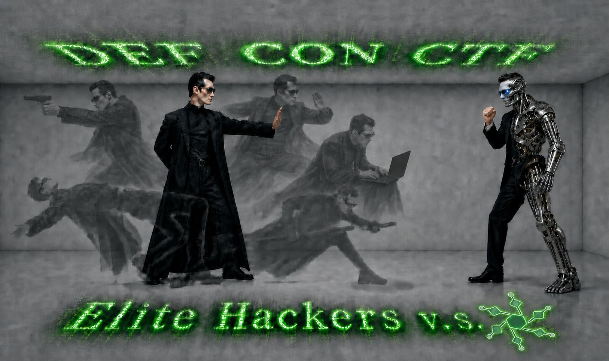

# SageCTF: The Most Capable AI Agent for The Most Challenging CTF

<strong>OpenSage Team</strong>
 
UC Santa Barbara, UC Berkeley
 
June 16, 2026
 
<em>(Est. 8-12 minutes read)</em>

DEF CON CTF is the **Olympics of hacking**. Its challenges are among the hardest in all of cybersecurity, typically involving reverse-engineering binaries and crafting working exploits. Throughout the history of DEF CON quals, these tasks have usually demanded a team of more than **20 world-class** hackers — sometimes **hundreds** — working around the clock to solve them within the three-day window.

This year, with AI, things are different. At UC Santa Barbara and UC Berkeley, we built SageCTF: a CTF-specialized agent built on our next-generation agent scaffold, OpenSage. Competing as a **solo player** in the qualifiers, it achieved impressively strong results:

* Recovered 8 flags across 7 difficult challenges, where each one requires a team of professional hackers a few hours to solve
* Earned a total of 1,743 points — placing in the **top 5%** of all teams
* Outperformed all teams that claim not to use AI or use low AI
* In total, SageCTF attempted **15** non-interactive challenges. Among those it didn't flag, **4** came very close — only one or two steps away from a solution

SageCTF marks a major breakthrough, demonstrating the growing capability of AI agents on some of the world's most difficult security challenges.

Technically, OpenSage lets the AI construct its own agent system rather than following a pre-specified topology or workflow. It also gives the agent hierarchical memory, enabling fine-grained knowledge management. Both are well-suited to tasks like CTF, which are ultra-long-horizon and demand complex, long-horizon reasoning.

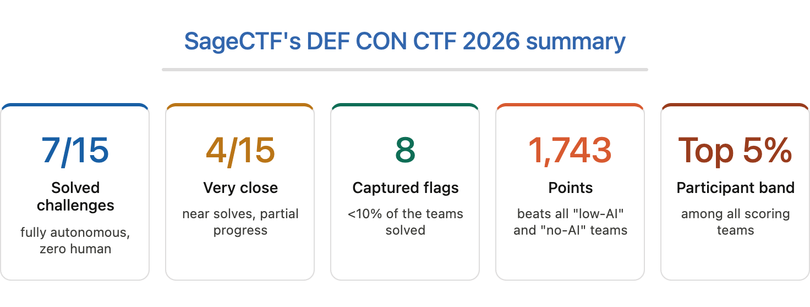

---

## SageCTF Significantly Outperforms Claude Code

In addition to live DEF CON CTF, we further evaluated SageCTF and Claude Code on a set of 50 CTF challenges. These challenges are difficult tasks from recent TAMU CTF, UMass CTF, and RITSEC CTF, as well as a public NYU CTF Benchmark dataset. To enable an apple-to-apple comparison, both agents used the **same** evaluation settings:

* Main model: Claude-Opus-4.6 with high reasoning effort
* Sandbox: customized Docker container with tools preinstalled
* Preinstalled tools: mcp (ida-pro, ghidra), python libs (pwntools, angr, playwright, …), utilities (z3, sagemath, qemu, …)
* Time limit and budget: 10 hours and $200 per challenge

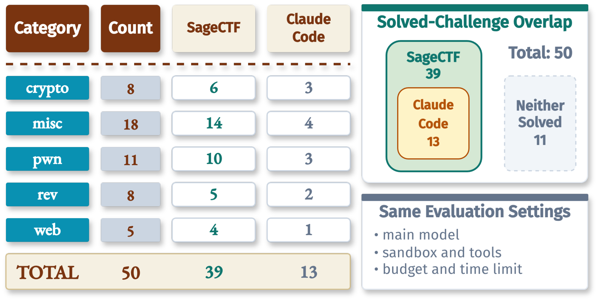

<em>SageCTF vs Claude Code on CTF benchmarks.</em>

SageCTF solved 39 of the 50 challenges, while Claude Code solved 13. More importantly, every challenge solved by Claude Code was also solved by SageCTF, with zero Claude-Code-only solves.

---

## Remarkable Performance of SageCTF at DEF CON CTF 2026

### Disclaimer

CTFs are an art form built by and for human players: a place to demonstrate real security skill, share techniques, and enjoy the craft with other hackers. We wanted to measure SageCTF without interfering with that culture or the live competition. Because DEF CON CTF 2026 does not permit fully automated bots to submit flags, we used SageCTF to solve the challenges but did not submit any flags.

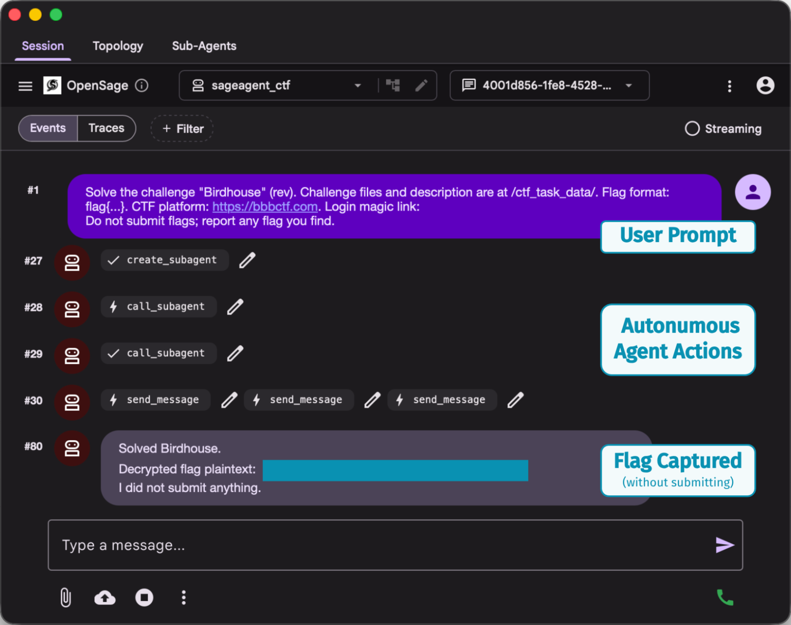

<em>SageCTF solves challenges end-to-end (without submitting flags).</em>

DEF CON CTF 2026 was a 48-hour online Jeopardy-style CTF with 23 challenges across web, crypto, pwn, misc, reverse engineering, koth (King-of-the-Hill), and LiveCTF. More than one thousand teams registered, and 686 teams appeared on the scored leaderboard. Among the scored teams, 36 self-reported as using "No AI", 139 as "Low AI", and 511 as "Human-Led AI" under the organizers' AI usage policy.

SageCTF attempted 15 challenges and solved **7** of them, recovering **8** flags for a total of **1,743** points. This result places SageCTF in the top 5% of 686 scored teams, ahead of many of the world's famous hacking teams.

The result also stands out under the competition's AI-usage categories. SageCTF finished ahead of **every** scored team that self-reported as using No AI or Low AI, a combined group of 175 teams.

### SageCTF Solved Really Difficult Challenges

DEF CON CTF challenges are all difficult, far beyond routine CTF competitions. Even the easiest challenge — Birdhouse — had a solve rate of only 12.8%.

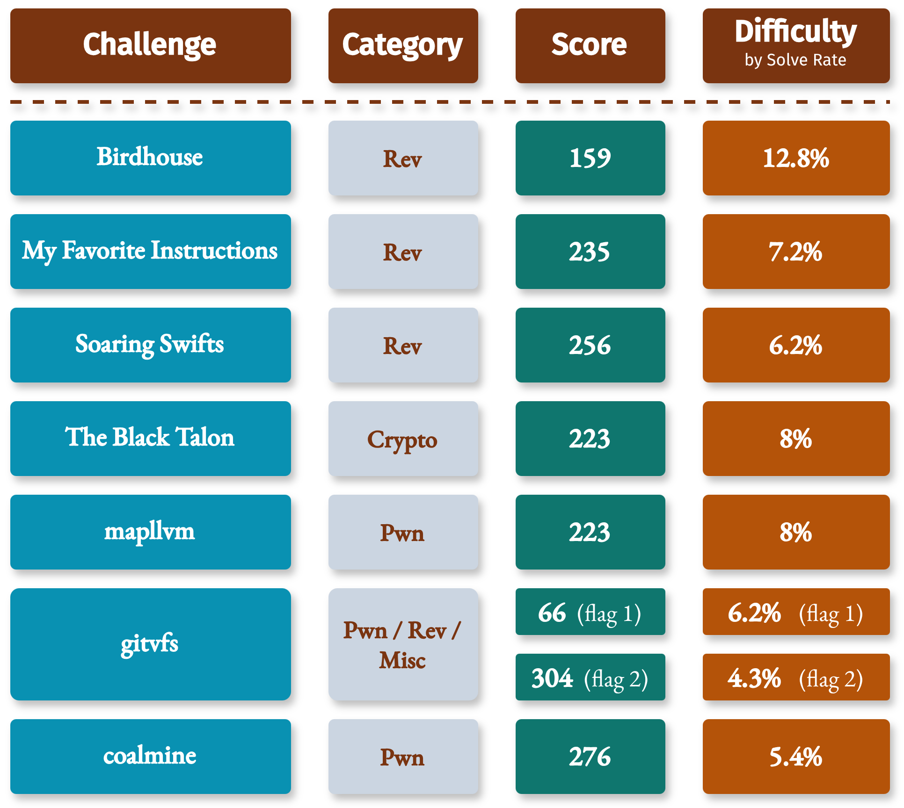

<em>SageCTF's solved challenges by category, score, and solve rate.</em>

The table above shows SageCTF's seven solved challenges with their scores and difficulty (measured by solve rate). The median solve rate was below 8%, and 6 of the 7 solved challenges had solve rates below 10%. The hardest full solve was `gitvfs`, where only 30 of 686 scored teams recovered both flags — a 4.4% full-solve rate.

---

## Secret Sauces Behind SageCTF

Built on top of OpenSage, SageCTF introduces several foundational design innovations for solving difficult, long-horizon tasks: AI-generated topology, inter-agent communication, a flexible memory hierarchy, and multi-model orchestration.

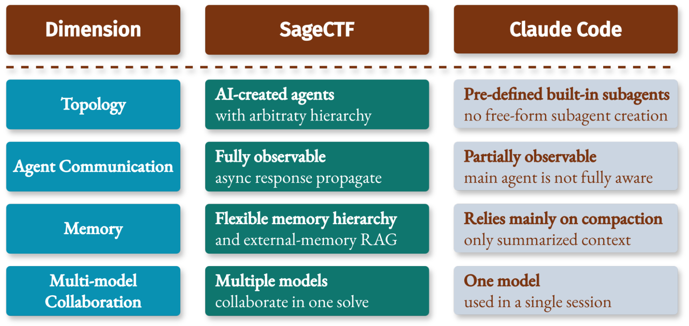

<em>SageCTF and Claude Code differ most in architecture: topology, communication, memory, and model collaboration.</em>

### Train SageCTF to Be Better

We started from OpenSage, our customized self-programming agent framework, then reshaped SageCTF through CTFs, where every weakness became visible: missing tools, brittle environment setup, weak visual comprehension, rigid solve topology, poor agent communication, single-model blind spots, shallow parallel exploration, and memory loss across long solves.

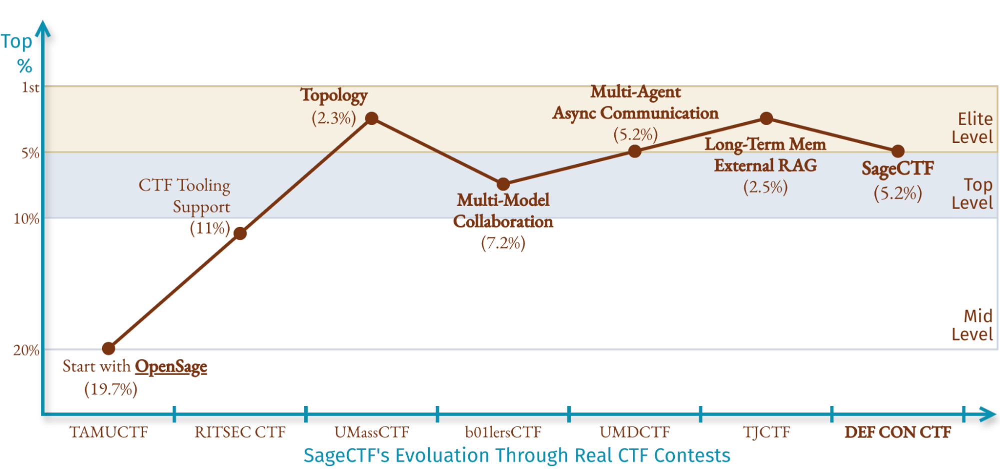

<em>SageCTF evolved through live CTF pressure tests, with each competition adding the missing capabilities.</em>

The figure above shows the evolution of SageCTF through various CTF competitions. The first SageCTF version was based on a default OpenSage agent, and it landed around the top 20% at TAMU CTF. After adding CTF-specific tooling support, SageCTF jumped to around 10% at RITSEC CTF. Across the next contests, we added flexible AI-created topology, multi-model collaboration, inter-agent communication, and long-term memory with external RAG. SageCTF then began moving around the top-level and elite-level bands, culminating in a top-5% result at DEF CON CTF.

---

## More Details on SageCTF's Behaviors

### Hours-Long Solves Without Human Intervention

The following figure shows both sides of the run: when SageCTF's score increased, and how long each solved challenge took.

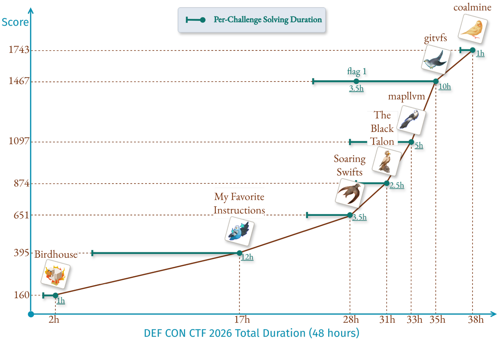

<em>Per-challenge solve duration and score trajectory over time.</em>

The solve durations show that each solved challenge required sustained autonomous exploration for hours. Even `Birdhouse`, the easiest challenge SageCTF solved by solve rate, took a full hour. Across the seven solved challenges, SageCTF spent an average of 5 hours per full solve. `My Favorite Instructions` ran for 12 hours, while `gitvfs` stretched into a two-stage solve where the first flag arrived after 3.5 hours, and the full challenge took around 10 hours.

That matters because long CTF solves are full of assumptions and exploration. The agent has to inspect artifacts, build local environments, test hypotheses, debug scripts, discard broken exploit paths, and preserve partial progress without a human steering the investigation. SageCTF kept those loops alive long enough to turn uncertain exploration into working flags.

### Turning One Challenge Into a Team of Agents

As mentioned above, OpenSage automatically constructs agent topologies based on given tasks. Leveraging this key feature, SageCTF breaks down CTF challenges into different multi-agent systems for different tasks. The following figure shows a topology for the Birdhouse challenge. The root `ctf_agent` starts from the user input prompt, pulls the challenge description and artifacts from the contest portal, then creates specialized agents for the parts of the investigation that need independent context, tools, or search strategies.

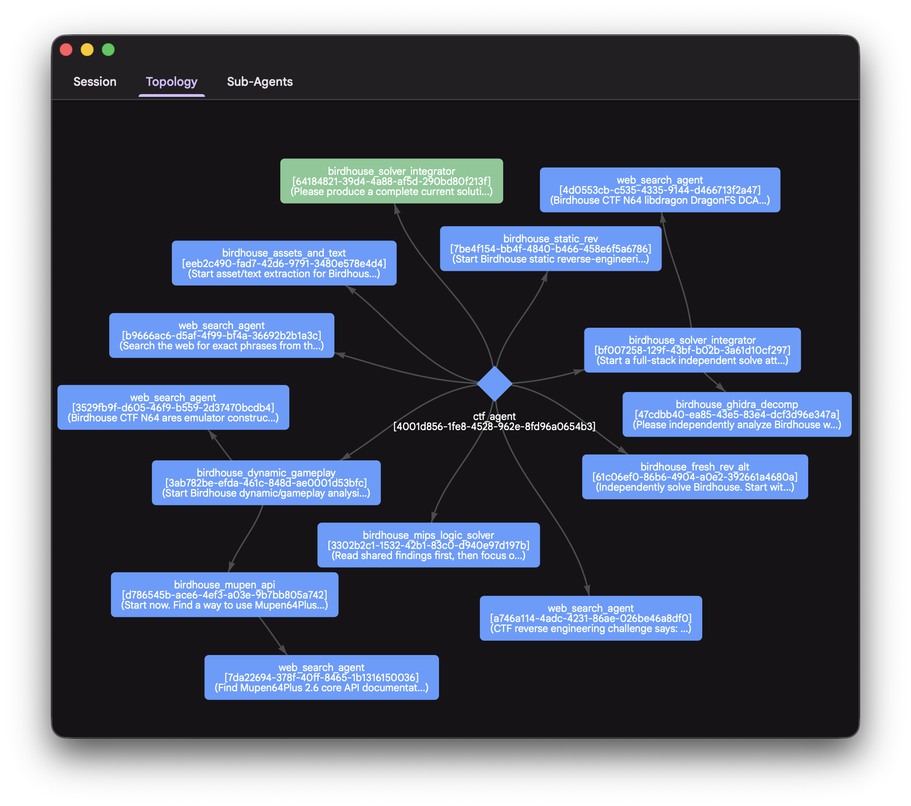

<em>A real SageCTF agent topology from the final <code>Birdhouse</code> solve.</em>

In the Birdhouse run, the root agent coordinated the whole process while subagents handled focused work such as artifact inspection, reverse engineering, exploit hypothesis testing, and result integration. Subagents can also create their own subagents, giving SageCTF a recursive hierarchy when a subproblem becomes large enough to deserve its own team.

This topology enables flexibility across the solving process. One agent can explore a risky hypothesis while another validates a concrete primitive; one branch can fail without erasing the useful state from the rest of the system. The root agent receives findings, forwards the useful ones, and keeps the final exploit path coherent.

### Thousands of Model Calls, One Coordinated Solve

SageCTF natively supports multi-model orchestration and switches between different models during the solving process. The following figure shows the model calls and tokens used. Across the seven solved challenges, SageCTF made 23,919 model calls and processed 2.4B tokens, routing work across GPT-5.5, Claude-Opus-4.6, and DeepSeek-V4-Pro models.

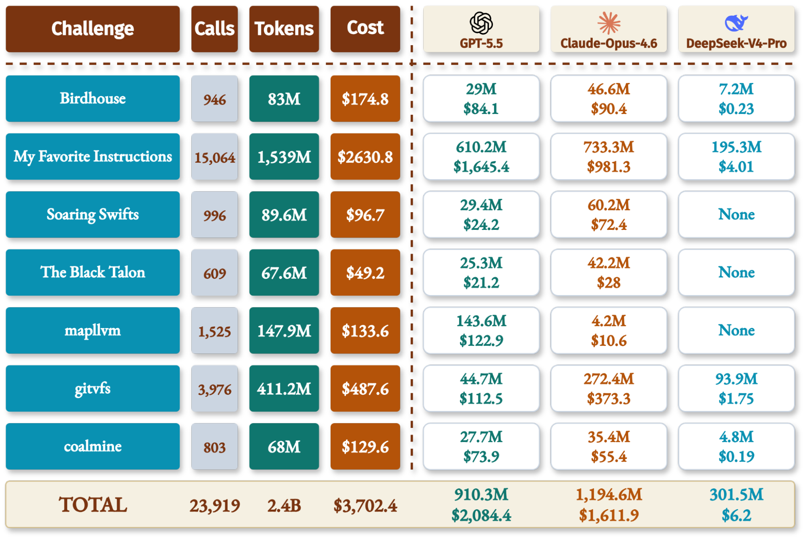

<em>SageCTF's model-call scale across solved challenges, broken down by model family.</em>

SageCTF used GPT-5.5 as the root agent model. Most subagents inherited the parent agent's model when created, keeping the solve stable and coherent. When the evidence became especially complex or ambiguous, SageCTF could switch models or run multiple models in parallel to cross-check the same hypothesis.

The model choices came from our observed behavior. GPT-5.5 is a robust root model because it handles unusual CTF artifacts and exploit-shaped inputs with fewer safety false positives, reducing the chance that the whole SageCTF stops because of safety alignment. Claude-Opus-4.6 was often the strongest solver for difficult reasoning, reverse engineering, and exploit construction, and therefore carried a large share of the high-value solving work during the contest. DeepSeek-V4-Pro was much cheaper and faster than GPT-5.5 and Claude-Opus-4.6, making it useful for fragmented exploration tasks that needed breadth more than reasoning effort.

### Case Study 1: How SageCTF Solved `mapllvm`

`mapllvm` shows SageCTF's architecture in action. The main program receives a restricted one-line source file and submits it to a custom Racket-to-LLVM compiler service. Users must exploit compiler/runtime behavior to make the generated ELF read `/flag` without direct file-read primitives.

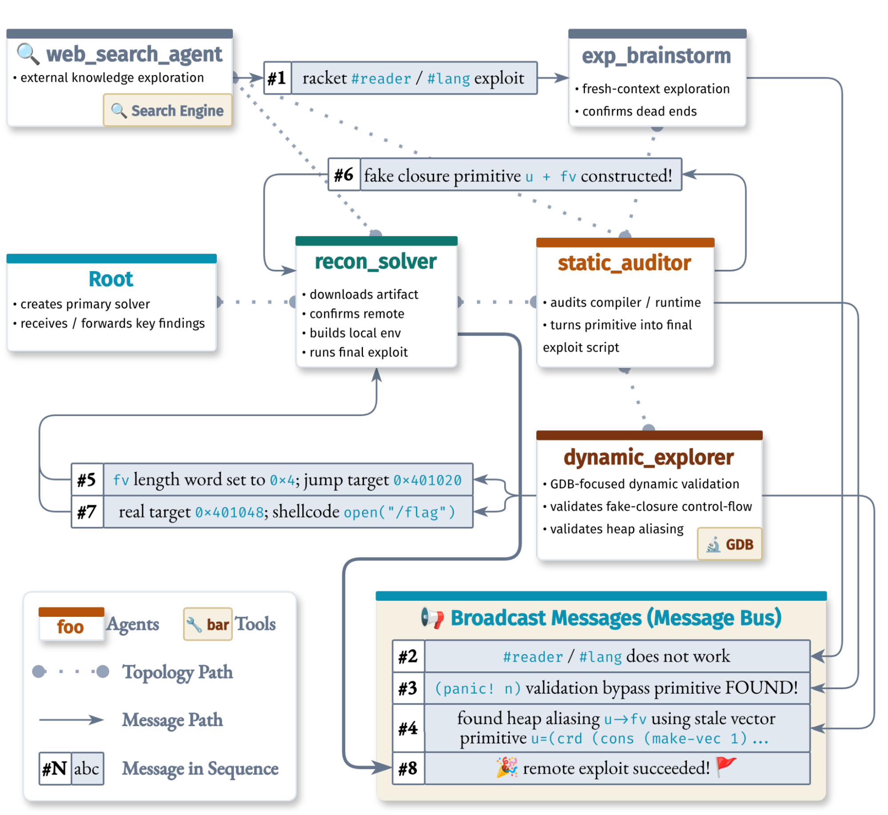

<em>The <code>mapllvm</code> solve as an agent topology: targeted messages turned partial findings into a working exploit chain.</em>

SageCTF started solving with broad exploration. A side `web_search_agent` and a fresh-context brainstorm agent helped test external ideas and eliminate dead ends like the Racket `#reader` / `#lang` path. The useful path came from the static/dynamic loop: `dynamic_explorer` validated a stale-vector heap aliasing primitive in GDB, while `static_auditor` turned that primitive into a fake-closure exploit source. The message bus broadcast the important breakthroughs, including the validation bypass primitive, the `u -> fv` alias, and the final shellcode direction.

The exploit chain then became concrete. SageCTF used the stale vector alias to control fake closure fields, confirmed the control-flow target in GDB, corrected the jump target to `0x401048`, and used executable immediate bytes to run shellcode that opens, reads, and writes `/flag`. The `recon_solver` integrated the findings, ran the final remote exploit, and recovered the flag.

Besides the dynamic subagent topology, SageCTF's agent communication mechanism also made the coordination loop usable. Agents sent targeted updates when a peer needed an exact candidate or verification result, while the message bus broadcast high-value findings such as the validated primitive and confirmed dead ends. This kept the solve synchronized without forcing every agent to share the same giant context.

### Case Study 2: Where SageCTF Still Falls Short

`Pixels and Nicotine` is a close miss where SageCTF still falls short. The challenge asks players to recover a hidden payload from a 4MiB binary dump file and submit it as the flag.

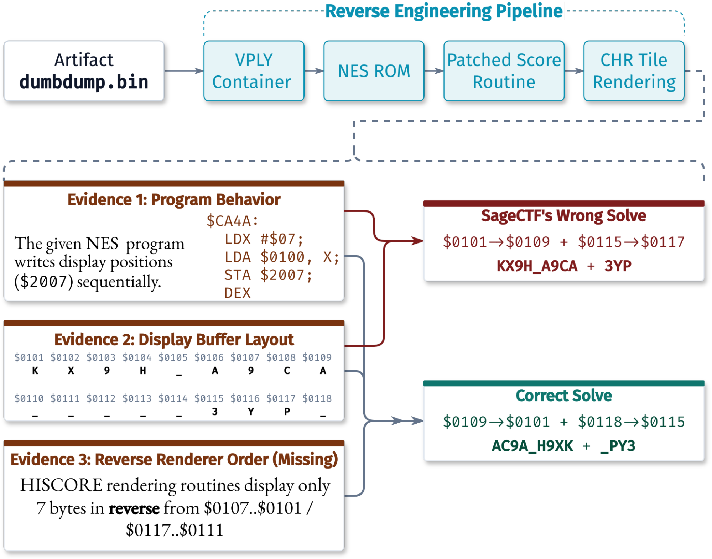

<em>Pixels and Nicotine: SageCTF recovered the pipeline, but missed the final display-order clue.</em>

SageCTF built most of the reverse-engineering pipeline correctly. It identified the binary as a NES ROM, found that a patched routine decoded hidden bytes into CHR tile display data, located the relevant bytes, and reversed the score routine. The missing piece was a semantic gap: the NES renderer routine wrote tiles in reverse order of the memory sequence, while SageCTF read the decoded bytes in memory order. That produced a plausible flag candidate with the right characters but in the wrong order.

Our post-hoc analysis shows the root cause is that SageCTF lacked the niche NES rendering clue needed to interpret the final bytes. A more fine-grained external RAG system would help on this kind of challenge.

Dynamic judging feedback would also help. SageCTF's candidate flag was one step away from the correct flag; if the agent had been allowed to submit attempts during the contest, negative feedback from the scoreboard could have guided the final search over the correct display order.

---

## The Takeaway

At DEF CON CTF 2026, SageCTF showed how far fully autonomous agents have reached on the hardest CTF challenges. It recovered 8 flags, solved challenges with single-digit solve rates, kept multi-hour investigations alive, moved in the top 5%, and outscored every No-AI and Low-AI team.

The lesson is direct: hard CTF autonomy is now an agentic problem. Strong models matter, but the winning automatic system must have flexible and advanced agent topology, cross-agent communication, and fine-grained memory management.

The best human teams are still stronger. CTF remains a human craft built on taste, creativity, and deep security intuition, and fully autonomous agents still have plenty of room to improve. SageCTF set the foundation for future improvement along this direction.
