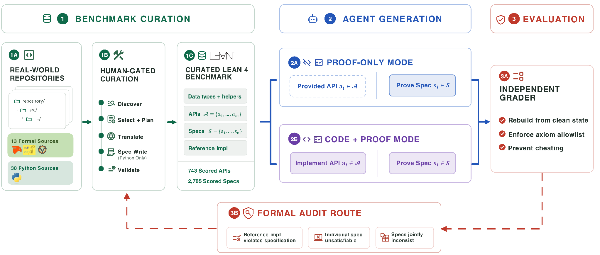
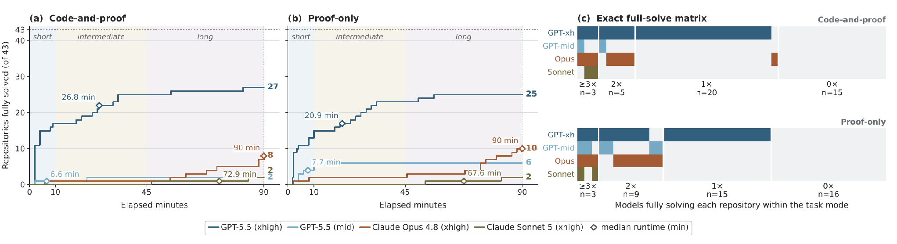
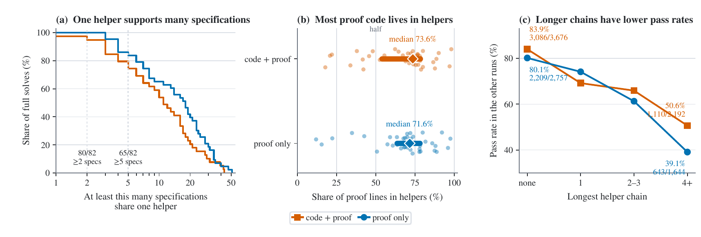

<style>
.blog-post ul { list-style-type: disc; padding-left: 2rem; }
.blog-post ol { list-style-type: decimal; padding-left: 2rem; }
</style>



# Vero: Can AI Agents Build Formally Verified Software Repositories?

<div class="author-info">
<strong>
    Zhe Ye*, Hantao Lou*, Yuechun Sun*, Peiyang Song, Zhengxu Yan, Timothe Kasriel, Qingyang Zhang, Kaiyu Yang, Soonho Kong, Jingxuan He, Dawn Song
</strong>
<br>
UC Berkeley; University of Chicago; California Institute of Technology; Stanford University; Apodex; Amazon Web Services
<br>
<em>*Equal contribution</em>
<br>
August 2026  |  Approximately 10-minute read  |  <a href="https://arxiv.org/abs/2608.13522">Paper</a>  |  <a href="https://vero.verina.io/">Project website</a>  |  <a href="https://github.com/sunblaze-ucb/vero">GitHub</a>
</div>


*AI coding agents can now make changes across entire repositories. But after an agent outputs “all tests pass,” can we trust them and their code?*

AI coding agents can now make changes across entire repositories, and they usually finish by reporting that all tests pass. That report is worth less than it sounds, because tests only check the cases someone thought to write down. Formal verification gives a much stronger guarantee. It produces a machine-checked proof that an implementation satisfies its specification on every input the specification covers, not just the ones in a test suite. So the natural question is whether an AI agent can actually work at this standard across a real codebase. Can it implement every required API in a multi-module repository, prove every supplied specification, and keep the code, the proofs, and the build consistent the whole way through? We built Vero to measure exactly that.

## TL;DR

Vero is, to our knowledge, the first benchmark that asks agents to write implementations and proofs together at the repository level. It contains 43 multi-module Lean 4 instances curated from real-world projects originally written in Python, Dafny, Verus, and Coq. Across the suite, agents face 743 scored APIs and 2,705 formal specifications.

The benchmark runs in two modes. In proof-only mode, the agent receives reference implementations and proves the specifications against them. In code-and-proof mode, the agent writes every required API itself and then proves that its own code satisfies every specification.

The strongest configuration we evaluated, GPT-5.5 (xhigh) with Codex, fully solves 27 of 43 instances in code-and-proof mode and 25 of 43 in proof-only. It passes 87.3% and 85.8% of individual specifications, respectively. Even so, 10 instances remain unsolved by every configuration in both modes. Taken together, the numbers show that proving individual specifications is no longer the hard part. The hard part is holding an entire proof repository together so that everything builds and every obligation closes.

## Key Takeaways

* **Repository completion is much harder than per-specification success.** GPT-5.5 (xhigh) passes 87.3% of specifications in code-and-proof and 85.8% in proof-only, but fully completes only 27/43 and 25/43 instances. Vero counts a run as a full solve only when every supplied specification is proved and the graded repository remains buildable and axiom-clean.

* **Reusable lemma libraries are a consistent pattern in full solves.** Across 82 full-solve runs, agent-written helper theorems contain a median of 73.6% of proof lines in code-and-proof and 71.6% in proof-only. In 80 of 82 full solves, at least one helper supports two or more specifications; in 65, a helper supports at least five.

* **Implementation freedom helps and hurts.** Agents sometimes replace a hard-to-prove reference algorithm with a simpler implementation satisfying the same specifications. The paper identifies five instance-agent pairs across three repositories where this helps. Conversely, 17 matched pairs are full solves in proof-only but not code-and-proof.

* **The benchmark has substantial headroom.** 10 of 43 instances remain unsolved by every configuration across both modes. The paper links many residual failures to global invariants, repeated behavior, supplied definitions, and deep chains of reusable lemmas.

## Why Vero Is New and Important

Most verified-code benchmarks focus on individual functions. The few repository-scale benchmarks generally provide a fixed implementation and evaluate proof generation alone. They therefore omit a central difficulty of real verification work: implementation and proof choices affect each other across a codebase.

Vero turns that coupling into the task. Agents must make coherent choices across a multi-module Lean 4 project, not solve a sequence of independent proof holes. This exposes long-horizon proof engineering, implementation-proof coordination, and build preservation that function-level evaluations do not measure.

## How Vero Works

### Repository scaffold

Each Vero instance is a self-contained Lean 4 project. Lean 4 is a programming language and theorem prover in which proofs are checked by a small trusted kernel. The curator supplies three frozen content layers:

* Shared data types and helper definitions.

* API signatures defining what must be implemented.

* Formal specifications written as predicates over a repository-wide implementation interface.

The agent fills implementation bodies and proof obligations. A full solve requires every specified obligation to pass when the grader rebuilds the repository from a clean benchmark source.


*Figure 1. Vero’s end-to-end construction, evaluation, grading, and formal-audit workflow.*

### One scaffold, two modes

**Proof-only mode.** The benchmark supplies the reference implementation. The agent must prove every specification against it. This isolates proof construction while retaining repository-scale dependencies.

**Code-and-proof mode.** Reference implementation bodies are withheld. The agent writes every required API body and proves each corresponding specification against its own implementation. This is Vero’s primary joint-generation setting.

Code-and-proof adds implementation obligations beyond task stacking. A proof-friendly algorithm may be much easier to verify than a faithful but difficult reference algorithm, while a poor implementation choice can create new proof obligations or break the build.

### Independent grading and anti-cheating safeguards

The grader extracts content only from permitted agent-editable regions, inserts it into a fresh project rendered from the benchmark source, and rebuilds the full project. It checks proof dependencies against an axiom allowlist and uses rule-based and LLM-judge screens to reject declarations or typeclass instances that trivialize obligations. These safeguards are designed to ensure that credited proofs are machine-checked and do not depend on edits to frozen benchmark content or disallowed axioms.

## Built from Real Repositories

Vero contains 43 instances: 13 translated from verification-aware projects written in Dafny, Verus, or Coq, and 30 translated from Python projects for which the curators also write formal specifications. The suite spans smart contracts and blockchain protocols, distributed systems and consensus, security-critical infrastructure, formal mathematics, data structures, algorithms, and numerical utilities.

The curation pipeline follows discover, select, plan, translate, specification writing when needed, and validate. Each stage runs as an LLM agent behind a human-review gate. The resulting Lean 4 implementations, specifications, and ground-truth proofs are novel curation work; no pre-existing public Lean 4 ground truth was available for the evaluated instances.

## Evaluation and Main Results

The evaluation covers four frontier coding-agent configurations under two agent harnesses. Every run receives full file-system, build, and Lean toolchain access and a 90-minute wall-clock budget.

| Agent configuration | Code-and-proof full solves | Proof-only full solves |
| --- | --- | --- |
| GPT-5.5 (xhigh) with Codex | 27 / 43 | 25 / 43 |
| Claude Opus 4.8 with Claude Code | 8 / 43 | 10 / 43 |
| GPT-5.5 (medium) with Codex | 2 / 43 | 6 / 43 |
| Claude Sonnet 5 with Claude Code | 2 / 43 | 2 / 43 |

*Table 1. Full-repository outcomes after the 90-minute budget.*

GPT-5.5 (xhigh) reaches 25 code-and-proof and 23 proof-only full solves within 45 minutes. Even so, most solved instances are completed by only one configuration, and 10 instances remain unsolved across all eight agent-mode combinations.



*Figure 2. Full-solve trajectories and exact full-solve matrix.*

Vero uses `full solve` as the primary outcome because partial specification coverage can be inflated by easier obligations. In code-and-proof mode, an unproved specification can indicate either a missing proof or an implementation that does not pass the specification. Per-specification coverage remains useful diagnostically, but only complete coverage certifies the submitted implementation against all benchmark specifications.

## What the Results Reveal

### Full-solve runs are built with proof dependencies

Across the 82 full-solve runs, helper theorems contain a median of 73.6% of proof lines in code-and-proof and 71.6% in proof-only. One helper supports at least two specifications in 80 of 82 full solves and at least five in 65.

Helper-chain depth is associated with lower pass rates in other runs. Specifications with no helper pass at 83.9% in code-and-proof and 80.1% in proof-only. At a chain depth of 4 or more, the pass rates fall to 50.6% and 39.1%. The pattern points to a need for better invariant discovery, proof-dependency planning, and reusable local libraries.



*Figure 3. Proof-helper reuse, proof-line share, and helper-chain pass rates.*

### Implementation freedom

Our paper identifies 5 instance-agent pairs across 3 repositories where an agent replaces a hard reference algorithm with a simpler implementation satisfying the same specifications. Via modifying those 5 pairs, code-and-proof closes all 250 specifications, while proof-only runs against the fixed reference close 201. The gain of implementation is mainly provability, and not necessarily production quality. Some substitutions sacrifice asymptotic efficiency.

Freedom can also add difficulty. 17 matched instance-agent pairs are full solves in proof-only but not code-and-proof. The trajectory analysis shows agents tend to commit to an implementation early and keep growing proofs until the deadline, rather than revisiting a definition when a proof plan repeatedly stalls.

## Continuous Improvement of the Benchmark

Formal-verification benchmarks can still contain latent errors that survive type-checking, successful builds, and curator review. Vero turns those errors into an iterative quality-improvement loop: rather than treating an impossible proof obligation as an agent failure, its audit mechanism accepts three forms of machine-checked negative evidence:

* The reference implementation violates a specification.

* No implementation can satisfy an individual specification.

* A set of specifications is jointly inconsistent even though its members are individually satisfiable.

Each formal witness sends the affected instance back to curator review and helps guide a correction. Every confirmed defect was repaired before the reported evaluation. The same feedback loop enables continuous benchmark improvement as future agents grow more capable and uncover subtler problems.

## Why Vero Matters

Repository-scale verified code generation offers a testbed for a stronger form of assurance than tests alone, particularly for high-assurance required software. The results show that current agents can complete a meaningful fraction of these tasks by building substantial proof libraries, identifying benchmark defects, and sometimes optimizing existing algorithms for provability. The remaining gap is repository-scale organization: discovering shared invariants, coordinating code and proof, and keeping the entire artifact consistent and buildable.

### Resources and Citation

[Project website](https://vero.verina.io/)  |  [Leaderboard](https://vero.verina.io/leaderboard/)  |  [Paper](https://arxiv.org/abs/2608.13522)  |  [GitHub](https://github.com/sunblaze-ucb/vero)

```bibtex
@article{ye2026vero,
  title={Vero: Can AI Agents Build Formally Verified Software Repositories?},
  author={Ye, Zhe and Lou, Hantao and Sun, Yuechun and Song, Peiyang and Yan, Zhengxu and Kasriel, Timothe and Zhang, Qingyang and Yang, Kaiyu and Kong, Soonho and He, Jingxuan and others},
  journal={arXiv preprint arXiv:2608.13522},
  year={2026}
}
```
